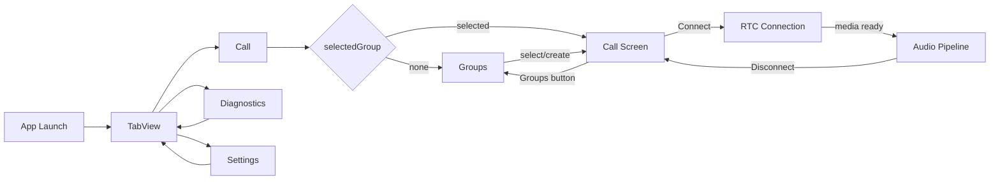

# RideIntercom 共通画面遷移

## 目的

本書は、作り直す RideIntercom App の画面間遷移の共通ルールを定義する。

個別状態遷移は `docs/spec/App/UI/画面・状態遷移.md`、画面項目は `docs/spec/App/UI/画面項目定義.md` から参照する画面別文書を正とする。

## 共通ルール

| 操作 | 遷移 | 接続への影響 |
|---|---|---|
| App 起動 | Call タブを開く | 接続は開始しない |
| group 未選択 | Groups 画面を表示 | 接続は開始しない |
| group 選択 | Call 画面へ進む | 明示 Connect まで media は開始しない |
| Groups ボタン | Groups 画面へ戻る | 既存接続は維持する |
| Diagnostics タブ | Diagnostics 画面へ移動 | 接続と media は維持する |
| Settings タブ | Settings 画面へ移動 | 接続と media は維持する。設定変更は可能な範囲で即時反映する |
| deep link invite 成功 | Call タブへ移動し、参加 group を選択する | 接続は自動開始しない |
| Disconnect | RTC connection と App audio pipeline を停止する | 明示的に停止する |

## 遷移図

## 非同期処理中の画面遷移

| 処理 | 画面遷移時の扱い |
|---|---|
| RTC 接続中 | タブ移動では継続する |
| media 開始中 | タブ移動では継続する。失敗時は Call と Diagnostics に反映する |
| Audio Check | Settings を離れても進行状態は保持する。Call で media 開始する操作とは競合させない |
| invite 受理 | 成功/失敗を App 状態に保存し、Call に戻って表示する |
