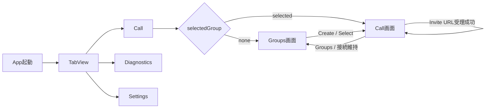
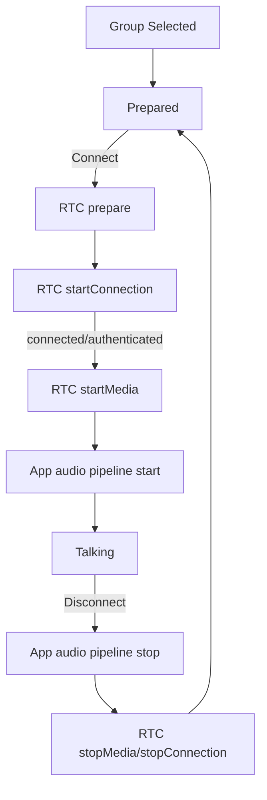
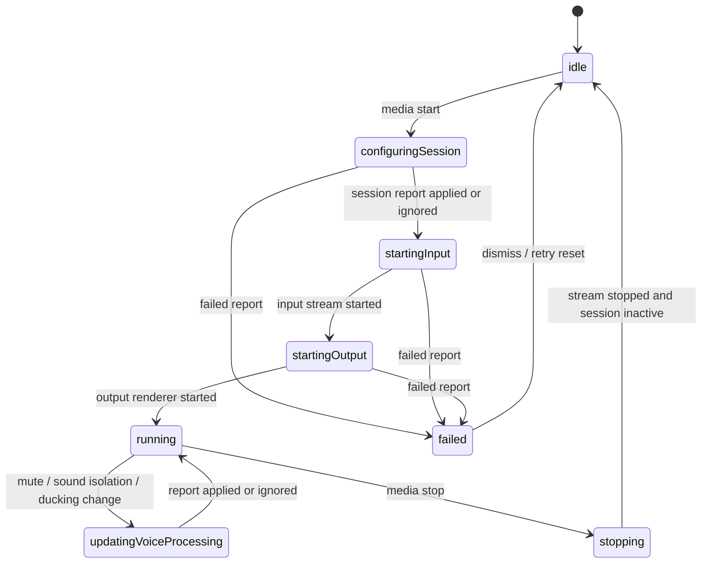
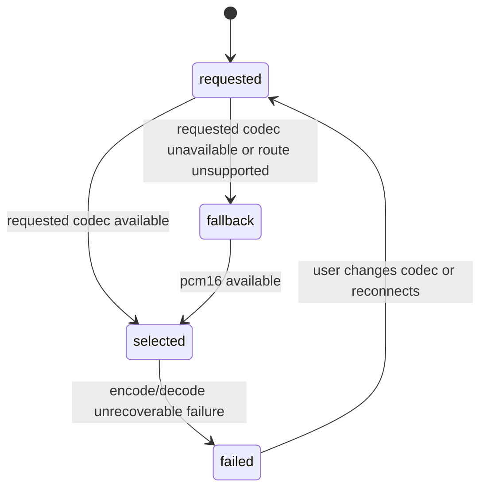
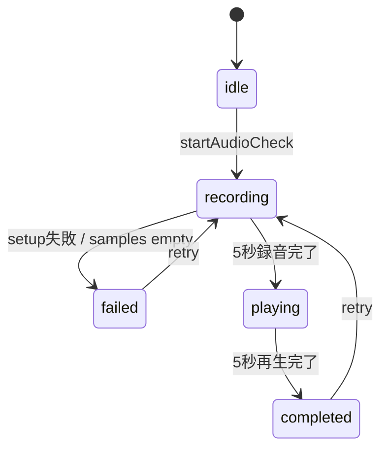

# RideIntercom 画面・状態遷移

## 目的

本書は、作り直す RideIntercom App の画面遷移と主要状態遷移を定義する。

RTC、SessionManager、Codec、Mixer の内部状態は各 package 仕様を正とし、本書では App が UI 表示へ要約する状態だけを扱う。

## 画面遷移

## Call 操作遷移

| 状態 | UI 表示 | package 対応 |
|---|---|---|
| Prepared | 選択 group、Connect 可能 | RTC request を組み立て可能 |
| Connecting | 接続準備中 | `CallSession.startConnection` 実行中 |
| Connected / Control Only | control plane 成立、media 未開始 | RTC connection 成立、media 未開始 |
| Starting Media | 音声開始中 | RTC `startMedia` と App audio pipeline start |
| Talking | 通話可能 | RTC media と App audio pipeline running |
| Reconnecting | 復旧中 | RouteManager fallback / restore |
| Failed | 再試行可能な失敗 | RTC / SessionManager / Codec の failed report |

## Audio pipeline 状態

| 状態 | App の扱い |
|---|---|
| `configuringSession` | `AudioSessionManager.configure(_:)` と `setActive(true)` の report を保持する |
| `startingInput` | `AudioInputStreamCapture.start()` の report を保持する |
| `updatingVoiceProcessing` | `AudioInputStreamCapture.updateVoiceProcessing(_:)` を呼び、入力 stream は止めない |
| `startingOutput` | `AudioOutputStreamRenderer.start()` の report を保持する |
| `failed` | Call の音声エラーと Diagnostics に表示し、ログへ記録する |

## Codec 状態

| 状態 | UI 表示 |
|---|---|
| requested | Settings の選択値 |
| selected | Diagnostics の Codec 行 |
| fallback | requested と selected を分け、理由を表示 |
| failed | codec error として Diagnostics とログに残す |

## AudioCheckPhase

## 補助状態

| 状態 | 遷移概要 |
|---|---|
| `selectedGroup` | `nil` なら Groups 画面、非 `nil` なら Call 画面 |
| `activeGroupID` | RTC 接続中または接続準備中の group ID |
| `audioCheckOwnsAudioPipeline` | 通話未開始時に Audio Check が一時的に audio pipeline を所有し、完了/失敗時に解放 |
| `isOtherAudioDuckingActive` | Duck Other Audio 設定 ON かつ可聴な受信音声が最終出力へ渡っている間だけ `true` |
| `selectedCodec` | `preferredTransmitCodec`、`CodecRuntimeReport`、route capability から決まる実 codec |

## 実装トレーサビリティ

| 遷移対象 | 参照先 |
|---|---|
| 画面遷移 | `docs/spec/App/UI/共通画面遷移.md` |
| 通話/通信状態 | `docs/spec/App/通信仕様.md`、`docs/spec/packages/RTC.md` |
| 音声状態 | `docs/spec/App/音声処理仕様.md`、`docs/spec/packages/Audio/SessionManager.md` |
| codec 状態 | `docs/spec/App/setting parameters/packages/Audio/Codec.md` |
