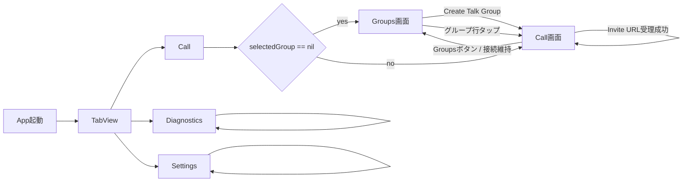
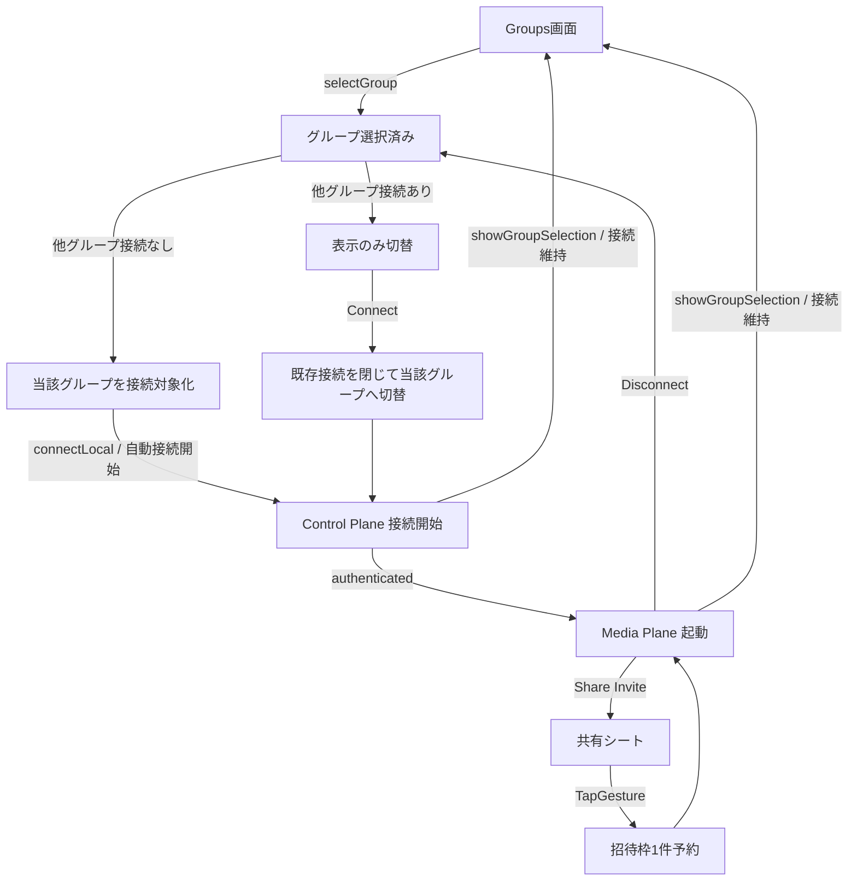
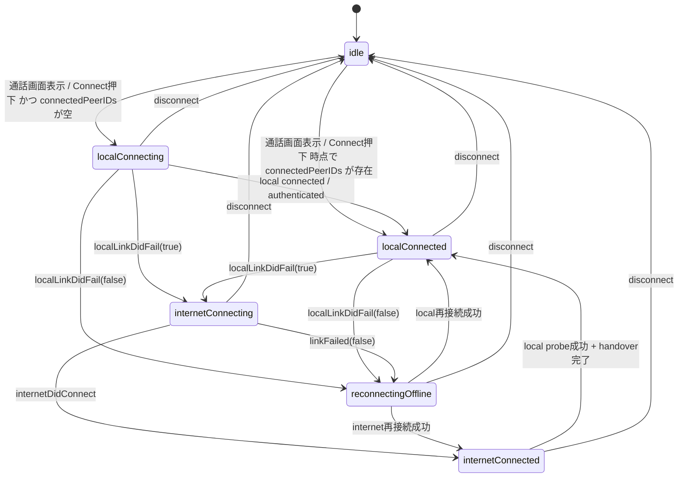
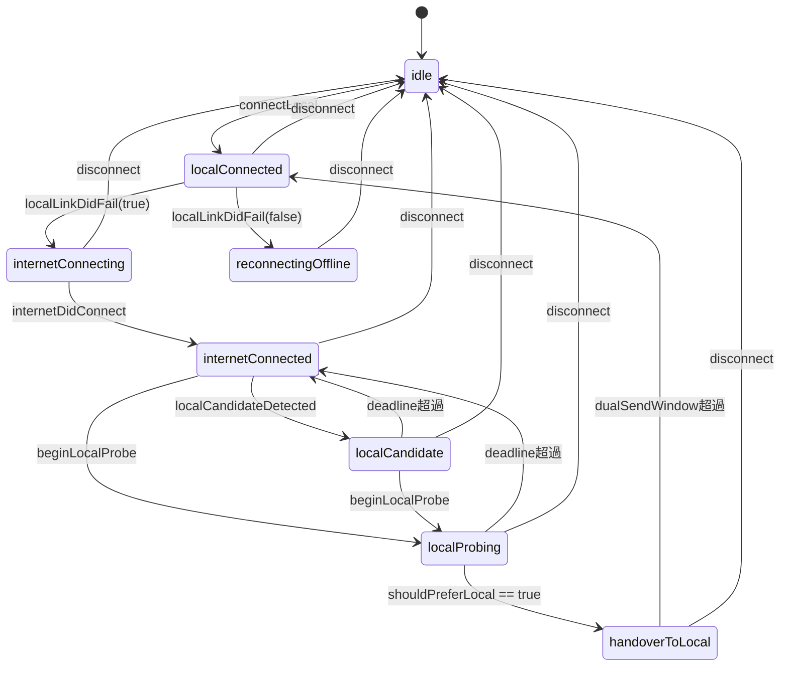
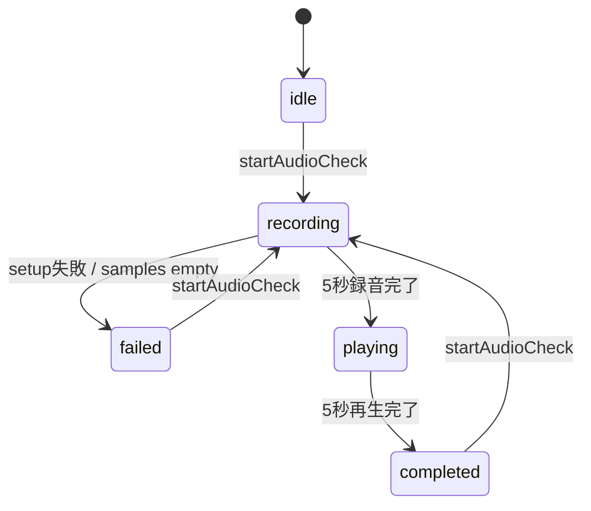
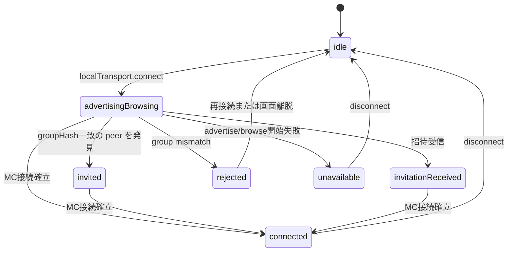
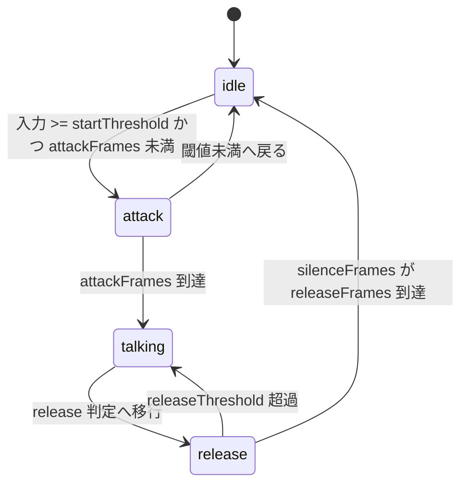

# RideIntercom 画面・状態遷移

## 目的

本書は現行実装の画面遷移と主要状態遷移を示す。  
対象は `ContentView.swift` と `IntercomCore.swift` に存在する遷移のみであり、未実装構想は含めない。

## 画面遷移

## Call 画面内の業務遷移

補足:

| 項目 | 現行仕様 |
|---|---|
| グループ選択直後 | 他グループ接続がなければ当該グループを接続対象として扱い、自動的に接続開始へ進む |
| 別グループ接続中のグループ選択 | 既存接続は維持し、通話画面表示だけを切り替える |
| Groups 画面へ戻る | `showGroupSelection` は一覧表示へ戻すだけで、接続中グループがあっても切断しない |
| Connect 押下 | まず Control Plane を開始し、認証成立後に音声パイプラインを起動する。別グループ接続中なら既存接続を閉じてから対象グループへ切り替える |
| 認証完了後 | `authenticatedPeerIDs` が揃うと Media Plane 起動へ進む |
| 接続済みだが音声未開始 | UI 上は `Connected / Audio Idle` と `Local / Control Only` などで表現する |
| Invite | 共有シートを開くのみ。QR 画面や専用招待画面はない |

## CallConnectionState

対象: `CallConnectionState`

補足:

| 項目 | 現行実装 |
|---|---|
| `CallConnectionState.localConnected` | 接続済みを表す。音声開始済みかどうかは別に `isAudioReady` で判定する |
| control-only 接続 | `selectedGroupConnectionState == .localConnected` かつ `isAudioReady == false` の間は `Connected / Audio Idle` を表示する |

## RouteCoordinator.phase

対象: `RouteCoordinator.Phase`

## AudioCheckPhase

対象: `AudioCheckPhase`

## LocalNetworkStatus

対象: `LocalNetworkStatus`

## VoiceActivityState

対象: `VoiceActivityState`

## 補助状態

| 状態 | 遷移概要 |
|---|---|
| `selectedGroup` | `nil` なら Groups 画面、非 `nil` なら Call 画面 |
| `activeGroupID` | 実際に接続対象として扱うグループ ID。`selectedGroup` と異なる場合がある |
| `audioCheckOwnsAudioPipeline` | 通話未開始時に Audio Check がセッションを所有し、完了/失敗時に解放 |
| `isMicrophoneCaptureSuspendedByMute` | ミュート継続 2 秒後に `true` となり、解除時に再開を試行 |

## 実装トレーサビリティ

| 遷移対象 | 実装 |
|---|---|
| 画面遷移 | `RideIntercom/RideIntercom/ContentView.swift` |
| 通話状態 | `RideIntercom/RideIntercom/IntercomCore.swift` |
| Local Transport 状態 | `RideIntercom/RideIntercom/MultipeerLocalTransport.swift` |
