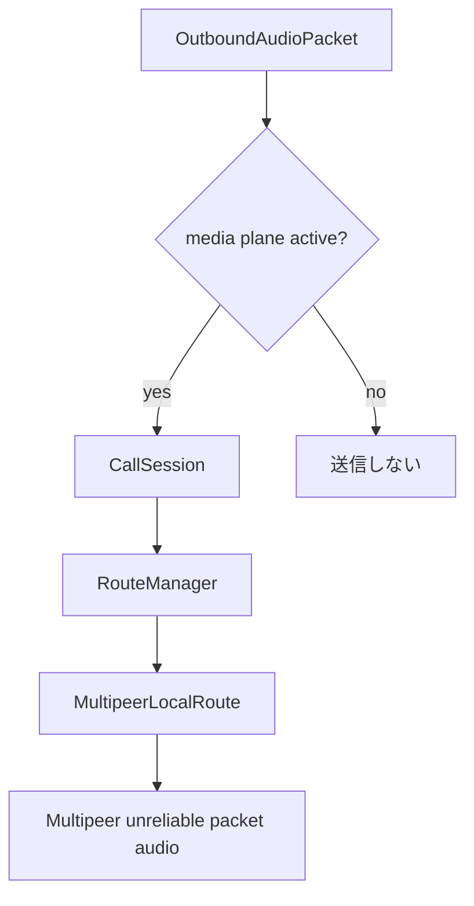

# RideIntercom 通信仕様

## 目的

本書は現行実装における通信経路、認証、招待 URL、送受信データ、経路切替の考え方を定義する。  
通信がどのような背景と方針で設計され、正常系と異常系でどう振る舞うかを、画面や診断表示と対応づけて記録する。

## 適用範囲

| 区分 | 内容 |
|---|---|
| Local | `MultipeerLocalTransport` による MultipeerConnectivity 通信 |
| Internet | 現行実装では非対応。将来 `WebRTCInternetRoute` として追加予定 |
| 認証 | `HandshakeMessage` による group secret ベースの MAC 検証 |
| 招待 | `rideintercom://join?token=...` の URL 招待 |
| 非対象 | サーバー API 詳細、QR 表示方式、共有シート以外の配布 UI 詳細 |

## 背景と基本方針

| 項目 | 内容 |
|---|---|
| 背景 | 山岳や移動体では圏外、不安定、近距離優位の状況があるため、まず Local を安定させ、将来 Internet へ退避できる構成が必要 |
| 目的 | 通話継続性を最大化しつつ、誤グループ接続と未認証音声受理を防ぐ |
| 優先経路 | Local |
| 方針 | 現行は Local のみを使用する。将来は Local が不成立または切断したときに WebRTCInternetRoute を使う |
| 意図 | 音声遅延とネットワーク依存を最小化しながら、切断時の無音時間を短くする |
| 異常系の考え方 | 経路失敗を即クラッシュや全停止に結びつけず、別経路や待機状態へ遷移して通話継続可能性を残す |

## 通信レイヤ構成

| レイヤ | 実装 | 役割 | 意味 |
|---|---|---|---|
| ViewModel 統合 | `IntercomViewModel` | グループ、メンバー、UI 状態、音声処理の統合 | UI と通話状態の接続点 |
| Session | `CallSession` | Core から見える単一通話 API | Core から経路差分を隠す境界 |
| 経路制御 | `RouteManager` | 優先経路の lifecycle 管理 | 将来の fallback / handover の中心 |
| Local Route | `MultipeerLocalRoute` | MC advertise/browse, invite, handshake, 音声送受信 | preferred / offline capable 経路 |
| Local Transport | `MultipeerLocalTransport` | MultipeerConnectivity の実送受信 | 近距離 packet audio transport |
| Internet Route | `WebRTCInternetRoute` | 未実装。将来の広域 fallback | Cloudflare または server signaling + WebRTC MediaStream |
| ペイロード | `AudioPacketSequencer`, `AudioPacketCodec`, `MultipeerPayloadBuilder` | voice envelope 化、符号化、control payload 化、application data payload 化 | 音声、RTC内部制御、アプリ自由データを別 payload として扱う |
| 認証/暗号 | `HandshakeService`, `PacketCryptoService` | MAC 検証、AES-GCM 暗号化 | 同一グループ確認と秘匿性確保 |

## 接続開始仕様

### Control Plane / Media Plane

| Plane | 役割 | 開始タイミング | 停止タイミング | 備考 |
|---|---|---|---|---|
| Control Plane | discovery, invite, session 接続, handshake, metadata/control 送受信 | `startStandby(group:)` または `connect(group:)` 呼び出し時 | 明示的 `disconnect()`、別グループへの切替時 | 音声 I/O を起動しなくても維持可能 |
| Application Data Plane | アプリ定義 metadata、presence、UI 同期、将来拡張データの送受信 | Control Plane が接続済みで peer 認証が成立した後 | 明示的 `disconnect()`、別グループへの切替時 | WebRTC の `RTCDataChannel` 相当。RTC は中身の schema を定義しない |
| Media Plane | マイク capture, voice packet 送信, 受信音声 decode, jitter, playout | Control Plane で peer が認証済みになった後 | 明示的 `disconnect()`、別グループへの切替時、route 側 media stop 時 | 接続成立前には開始しない |

補足: 現行実装では `CallSession.connect(group:)` と音声起動が密結合だが、今後は「接続確立」と「音声開始」を別段階として扱う。

補足: 接続済みとは Control Plane が成立し、metadata/control を送受信できる状態を指す。通話中とは Media Plane が起動済みで、音声送受信が可能な状態を指す。

補足: アプリ自由データは音声開始前でも送受信できるが、未認証 peer からの受信は破棄する。RTC 内部の route control は handshake、keepalive のような通話基盤制御に限定し、mute 同期などのアプリ都合の任意データは `ApplicationDataMessage` を使う。

### グループ選択時

| 項目 | 動作 | 意味・意図 |
|---|---|---|
| `selectGroup` | 選択グループを通話画面へ表示する。アクティブ接続がなければ当該グループを接続対象として初期化し、アクティブ接続が別グループにある場合はその接続を維持したまま表示だけ切り替える | 画面閲覧と実接続先の切替を分離し、意図しない接続奪取を防ぐ |
| `startLocalStandby()` | 音声未開始のまま `callSession.startStandby(group:)` を呼び、近距離ピア待受だけを開始する。対象はアクティブ接続先のグループのみとする | すぐ話し始めなくても Local 発見を先行させ、招待直後や再度画面を開いた時にも当該グループへ戻りやすくする |
| `showGroupSelection` | グループ一覧画面へ戻すだけで、アクティブ接続は維持する | 画面遷移だけで通話を切らないようにする |
| 接続表示 | `connectionState = .idle` のまま。`localNetworkStatus` は MC イベントで更新 | 「待受」と「通話接続済み」を分離して表現する |

### 通話画面表示時の接続方針

| 項目 | 動作 | 意味・意図 |
|---|---|---|
| 通話画面を開いた時 | 当該グループの通話画面が開いていて、かつ他のグループ接続が存在しない場合は、Connect ボタン押下がなくても当該グループを接続対象状態とする | 招待後や再表示時にも同じグループへ自然に復帰できるようにする |
| 自動接続の制約 | 他のグループ接続が存在する間は、自動では切り替えない | 意図しないグループ切替を防ぐ |
| Connect ボタン | 自動接続方針を採っても UI 上は残し、明示的な接続開始、切断、接続先切替の操作点として維持する | 自動挙動と手動制御を両立する |
| 通話画面以外へ遷移した時 | Groups 画面など通話画面以外へ戻っても、明示的な Disconnect や別グループへの Connect 切替がない限り接続を維持する | 一覧確認や画面移動で通話を落とさないようにする |

### Connect 押下時

| 項目 | 動作 | 意味・意図 | 異常系の考え方 |
|---|---|---|---|
| ルート初期化 | `callSession.connect(group:)` | MultipeerLocalRoute の接続試行を開始する | なし |
| Control Plane 開始 | advertise / browse / invite / handshake を開始する | 接続可否と peer 認証を先に確立する | この段階では音声 I/O を上げない |
| 接続状態 | `connectedPeerIDs` が空なら `localConnecting`、存在すれば `localConnected` | 相手の有無で状態を分ける | 接続済みでも音声未開始の状態を許容する |
| Media Plane 開始 | `authenticatedPeerIDs` が揃った後に音声起動へ進む | 未認証 peer へ mic を開かず、音声処理を接続後へ遅延させる | 音声起動失敗時も接続状態自体は切り分けて扱う |
| Local connect 再利用 | `localNetworkStatus` が `idle` または `unavailable` の場合のみ `callSession.connect(group:)` を再実行 | 不要な再接続を抑える | Local が既に動作中なら再実行しない |
| 他グループ接続中の Connect | 別グループ接続が存在する状態で Connect を押した場合は、既存のグループ接続を閉じてから、押下したグループの接続へ切り替える | UI 上の選択グループと実接続先を一致させる | 切替中は一時的に切断状態を経由してよい |

## 経路選択仕様

### 基本方針

| 項目 | 現行仕様 | 意味・意図 |
|---|---|---|
| 優先経路 | Local | 低遅延、近距離自律動作を優先する |
| Local 失敗時 | `reconnectingOffline` | 現行は WebRTC fallback 未実装のため再接続待機へ移行する |
| Internet 失敗時 | 未実装 | `WebRTCInternetRoute` 追加時に定義する |
| Internet 利用中の Local 再優先 | 未実装 | `WebRTCInternetRoute` 追加時に `RouteManager` で扱う |
| dual send | 未実装 | handover 導入時に `RouteManager` と `MediaCoordinator` で扱う |

### RoutePolicy 判定値

| 指標 | しきい値 | 意味 |
|---|---|---|
| `peerCount` | `>= expectedPeerCount` | 必要 peer 数が揃っているかを見る |
| `rttMilliseconds` | `<= 180` | 会話可能な遅延を維持できるかを見る |
| `jitterMilliseconds` | `<= 60` | 再生の揺らぎが大きすぎないかを見る |
| `packetLossRate` | `<= 0.10` | 受信欠落が許容範囲かを見る |
| `probeWindow` | `7.5 sec` | Local 再優先判断の観測期間 |
| `dualSendWindow` | `1.0 sec` | 音切れを避ける二重送信期間 |

### 送信先選択

補足:

| 項目 | 内容 |
|---|---|
| 背景 | 現行は MultipeerLocalRoute のみを実装する |
| 方針 | Core は `CallSession` に送信し、`RouteManager` が active route へ委譲する |
| 意図 | 将来 WebRTCInternetRoute を追加しても Core の送信 API を変えない |

## Local 通信仕様

### discover / invite

| 項目 | 仕様 | 背景・意味 |
|---|---|---|
| Service type | `ride-intercom` | MC 上の識別子 |
| discoveryInfo | `LocalDiscoveryInfo.makeDiscoveryInfo(for:)` が生成する `groupHash` 系情報 | 広告段階で同一グループ候補を絞る |
| 発見時の一致判定 | `LocalDiscoveryInfo.matches(info, credential:)` | 他グループ誤接続を減らす |
| 不一致時 | `localNetworkStatus = .rejected(.groupMismatch)` | 不一致を単なる未発見ではなく拒否理由として扱う |
| 招待時 | 一致した peer に対して短い遅延後に `browser.invitePeer(... timeout: 10)` | 同一グループ候補だけ招待しつつ、同時招待衝突を減らす |
| 招待タイミング制御 | peer ごとに pending invite と scheduled task を持ち、重複 invite を抑止する | 発見イベント多発時の再招待ループを避ける |
| invite context | `groupHash` を invitation context に含める | advertiser 側で受信直後に同一グループ確認できるようにする |
| 招待受信時の検証 | `LocalInvitationContext.groupHash == credential.groupHash` を満たす場合のみ accept | handshake 前に別グループ接続を落とし、セッション揺れを減らす |
| 招待受信時の不一致 | `localNetworkStatus = .rejected(.groupMismatch)` とし `invitationHandler(false, nil)` | 不正 invite を接続成立前に拒否する |

### Local の認証/切断

| 項目 | 仕様 | 意味・意図 | 異常系の考え方 |
|---|---|---|---|
| MC 接続時 | 接続相手へ `ControlMessage.handshake` を reliable 送信 | 接続後にも同一グループ確認を行う | 発見一致だけで信用しない |
| handshake 検証 | `HandshakeRegistry.accept` | 秘密情報を持つ相手だけを認証する | なし |
| 検証成功 | `TransportEvent.authenticated(peerIDs:)` を送出 | Control Plane 上で「音声開始可能」な相手として登録する | なし |
| 検証失敗 | `localNetworkStatus = .rejected(.handshakeInvalid)` とし `cancelConnectPeer` | 未認証相手を残さない | 即切断する |
| 未認証 peer の音声 | 受理しない | 音声受理と接続成立を分離する | 接続済みでも音は通さない |

### Local の media 起動

| 項目 | 仕様 | 意味・意図 |
|---|---|---|
| 起動条件 | `authenticatedPeerIDs` が 1 以上になった後に Media Plane を開始する | 接続と音声を分離する |
| route への通知 | `CallSession.startMedia()` を active route に送る | RTC 側でも media gate を持ち、認証前の音声送受信を止める |
| 接続中 metadata | keepalive, mute state, handshake は Media Plane 起動前でも送受信可能 | 接続準備を軽く保つ |
| 音声付随 metadata | codec, frame 識別 metadata は RTC route 内部 control として送る | 音声 frame には再生に必要な情報だけを残し、RTC public API には露出しない |
| アプリ自由データ | `ApplicationDataMessage` として専用 payload で送る。`namespace`, `payload`, `delivery` 以外の意味はアプリ側が決める | RTC がアプリ機能の schema を縛らず、WebRTC DataChannel へ移行しやすくする |
| mic 起動前 | マイク capture, encode, voice packet 送信は開始しない | 不要な AVAudioSession 起動を防ぐ |
| keepalive 経路 | metadata keepalive は `sendControl(.keepalive)` として Control Plane で送る | 音声 frame と独立して接続維持を行う |
| 切断条件 | 明示的 Disconnect、別グループ Connect 切替、route stop 時 | 画面遷移だけで音声を止めない |

### Local の暗号化

| 項目 | 仕様 | 意味 |
|---|---|---|
| 音声 payload | `PacketCryptoService.encrypt` / `decrypt` | Local 音声 frame の秘匿化 |
| 鍵 | `GroupAccessCredential.symmetricKey` | グループ secret 由来鍵 |
| 制御 payload | JSON (`ControlPayloadEnvelope`)。音声とは別経路 | 制御と音声を分離し扱う |

## Internet 通信仕様

現行実装では Internet 経路を持たない。旧 Internet adapter / loopback adapter は削除済みであり、音声 transport は MultipeerLocalRoute に一本化する。

将来の広域 fallback は `WebRTCInternetRoute` として追加する。

| 項目 | 方針 |
|---|---|
| discovery | server / meeting 参加状態で扱う |
| signaling | Cloudflare RealtimeKit Core SDK または専用 server signaling を候補にする |
| media | WebRTC MediaStream / RTP / SRTP を使う |
| application data | WebRTC `RTCDataChannel` を使う。任意バイナリを media track と別扱いにする |
| role | fallback / wide area |
| Core からの見え方 | `CallSession` の event と member state に正規化する |

## 招待 URL 仕様

### 生成

| 項目 | 仕様 | 意味・意図 |
|---|---|---|
| 形式 | `rideintercom://join?token={base64url(JSON)}` | アプリ内で直接受理できる共有形式 |
| 本体 | `GroupInviteToken` | グループ参加に必要な最小情報をまとめる |
| 期限 | `issuedAt + 7 days` | 古い招待の誤利用を抑える |
| 共有 UI | Call 画面の `ShareLink` | 通話文脈から相手招待へつなげる |

### token フィールド

| フィールド | 型 | 内容 | 意味 |
|---|---|---|---|
| `version` | `Int` | 現在は `1` 固定 | 形式互換性の識別 |
| `groupID` | `UUID` | 参加先グループ | 接続先識別 |
| `groupName` | `String` | グループ表示名 | 受理時表示用 |
| `groupSecret` | `String` | 共有 secret | 認証/暗号化の根拠 |
| `inviterMemberID` | `String` | 招待元メンバー ID | 招待元識別 |
| `issuedAt` | `TimeInterval` | 発行時刻 | 有効期間判断の起点 |
| `expiresAt` | `TimeInterval?` | 失効時刻 | 期限切れ判断 |
| `signature` | `String` | `groupSecret` を用いた HMAC-SHA256 | 改ざん検知 |

### 受理

| 項目 | 仕様 | 意味・意図 | 異常系の考え方 |
|---|---|---|---|
| 入口 | `ContentView.onOpenURL` | 外部招待の統一入口 | なし |
| デコード | `GroupInviteTokenCodec.decodeJoinURL` | URL から token を復元する | 復元失敗は受理しない |
| 検証 | version, signature, expiresAt | 改ざんや期限切れを弾く | 不正 token は参加状態へ進めない |
| 受理後 | Keychain に secret 保存、グループを保存/選択、`inviteStatusMessage = "JOINED {groupName}"` | 参加完了を通話文脈へ反映する | なし |
| 作成されるメンバー | ローカルメンバー + `Inviter` 表示名の招待元メンバー | 受理直後から最低限の相手情報を持てるようにする | なし |

## データ仕様

### HandshakeMessage

| フィールド | 内容 | 意味 |
|---|---|---|
| `groupHash` | `groupID + secret` 由来の SHA-256 | 同一グループ識別 |
| `memberID` | 送信者メンバー ID | 相手識別 |
| `nonce` | 使い捨て文字列 | リプレイ抑止 |
| `mac` | `groupHash|memberID|nonce` を secret で HMAC-SHA256 | 真正性確認 |

### AudioPacketEnvelope

| フィールド | 内容 | 意味 |
|---|---|---|
| `groupID` | グループ識別 | 受理対象判定 |
| `streamID` | ストリーム識別 | 重複排除、系列追跡 |
| `sequenceNumber` | 連番 | 欠落、順序、重複判定 |
| `sentAt` | 送信時刻 | jitter / 受理時刻補正 |
| `kind` | `voice` | Media Plane の音声 frame であることを示す |
| `encodedVoice` | 音声 payload。`codec` は実際に media payload として送る codec | 音声本体と復号に必要な media codec |

### ControlMessage

| 種別 | 送信モード | 用途 | 意味 |
|---|---|---|---|
| `keepalive` | unreliable | 接続維持 | 音声 frame を使わずに経路を維持する |
| `handshake` | reliable | Local 認証 | 音声受理前の認証成立に使う |

### ApplicationDataMessage

| フィールド | 型 | 内容 | 意味 |
|---|---|---|---|
| `namespace` | `String` | アプリ側が決める用途識別子 | presence、UI同期、診断拡張などの区別に使う |
| `payload` | `Data` | 任意バイナリ | RTC は内容を解釈せず、そのまま配送する |
| `delivery` | `ApplicationDataDelivery` | `reliable` または `unreliable` | WebRTC DataChannel / Multipeer の配送信頼性へ対応させる |

| ルール | 仕様 |
|---|---|
| schema 所有 | アプリ側が所有する。RTC は `namespace` の予約語や payload 形式を定義しない |
| 送信 API | `CallSession.sendApplicationData(_:)` を使う。`sendControl(_:)` には載せない |
| 受信 event | `TransportEvent.receivedApplicationData(peerID:message:)` で通知する |
| Media Plane 依存 | 依存しない。音声未開始でも、Control Plane 接続と peer 認証が成立していれば受信可能 |
| WebRTC 対応 | `RTCDataChannel` に対応させる。音声 `MediaStream` / RTP / SRTP には混ぜない |

### RideIntercom Application Data

| namespace | delivery | payload 所有 | 用途 |
|---|---|---|---|
| `rideintercom.peerMuteState` | reliable | RideIntercom app | 相手画面の送話ミュート状態同期 |

補足: `rideintercom.peerMuteState` は RTC から見ると任意の application data であり、RTC package はこの namespace や payload schema を定義しない。RideIntercom adapter が `ApplicationDataMessage` を解釈して `remotePeerMuteState` に変換する。

## 受信受理条件

| 項目 | 現行仕様 | 意味・意図 | 異常系の考え方 |
|---|---|---|---|
| group 一致 | `ReceivedAudioPacketFilter(groupID:)` が一致する envelope のみ受理 | 他グループ音声を混入させない | 不一致は破棄する |
| Local 認証 | `authenticatedPeerIDs` に存在する peer のみ音声受理 | 接続と音声受理を分離する | 未認証音声は破棄する |
| Application Data 認証 | `authenticatedPeerIDs` に存在する peer のみ受理 | アプリ自由データも同一グループ認証後に限定する | 未認証データは破棄する |
| 重複排除 | `streamID + sequenceNumber` ベース | dual send や再送相当を整理する | 先着採用で重複は捨てる |
| 復号失敗 | 破棄 | 不正または破損 payload を通さない | 復号失敗を再生に回さない |
| keepalive | 音声再生はしない | 接続維持情報と音声本体を区別する | 無音 packet として扱う |

## 異常時の設計方針

| 事象 | 方針 |
|---|---|
| Local browse / advertise 開始失敗 | `localNetworkStatus` に理由を反映し、Internet 可用性があれば代替経路判断へ回す |
| Local link fail かつ Internet 利用可 | `connectionState` を Internet 側へ進め、通話継続を優先する |
| Local link fail | `reconnectingOffline` とし、再接続待機状態を保つ |
| handshake 不一致 | 受理せず切断し、拒否理由を保持する |
| media codec 復号失敗 | 該当 frame を破棄し、受信途絶や drop の診断で原因を追えるようにする |

## 設定値との意味対応

参照元: [設定値一覧](設定値一覧.md)

| 項目 | 通信上の意味 |
|---|---|
| 送信 codec | media payload の codec と送信 fallback 診断に影響する |
| HE-AAC 品質 | HE-AAC 系の符号化品質概念に対応する |
| VAD 閾値 | voice / keepalive の発行頻度に影響する |
| ローカルマイクミュート | voice 送出停止と RideIntercom application data による mute 同期に影響する |
| 入力デバイス | 送信元音声の性質に影響する |
| 出力デバイス | 通信経路ではなく再生経路にのみ影響する |
| Sound Isolation | 入力信号特性を変え、VAD と送信音声内容に影響する |

## 実装トレーサビリティ

| 領域 | 実装 |
|---|---|
| Local 通信 | `RideIntercom/RideIntercom/MultipeerLocalTransport.swift` |
| Internet 通信 | 未実装。将来 `WebRTCInternetRoute` として追加予定 |
| 招待 / 認証 / 暗号 | `RideIntercom/RideIntercom/IntercomCore.swift` |
