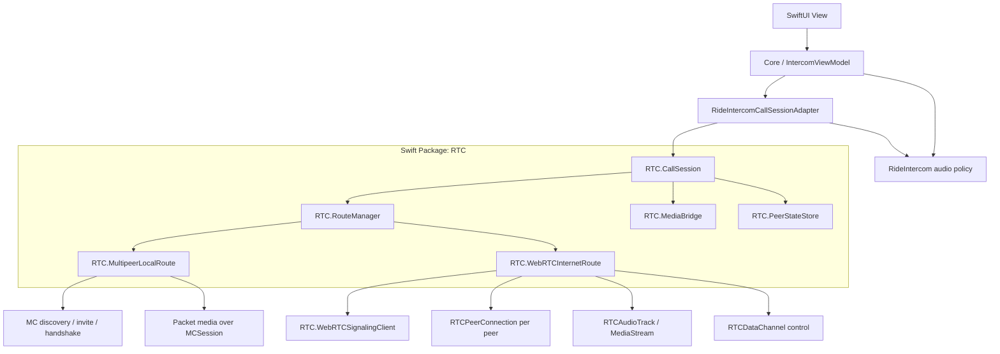
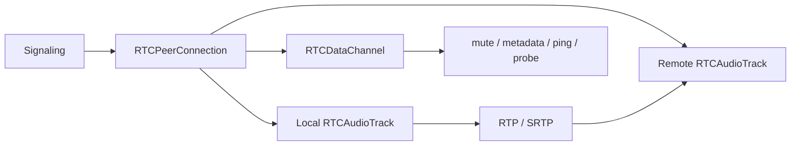
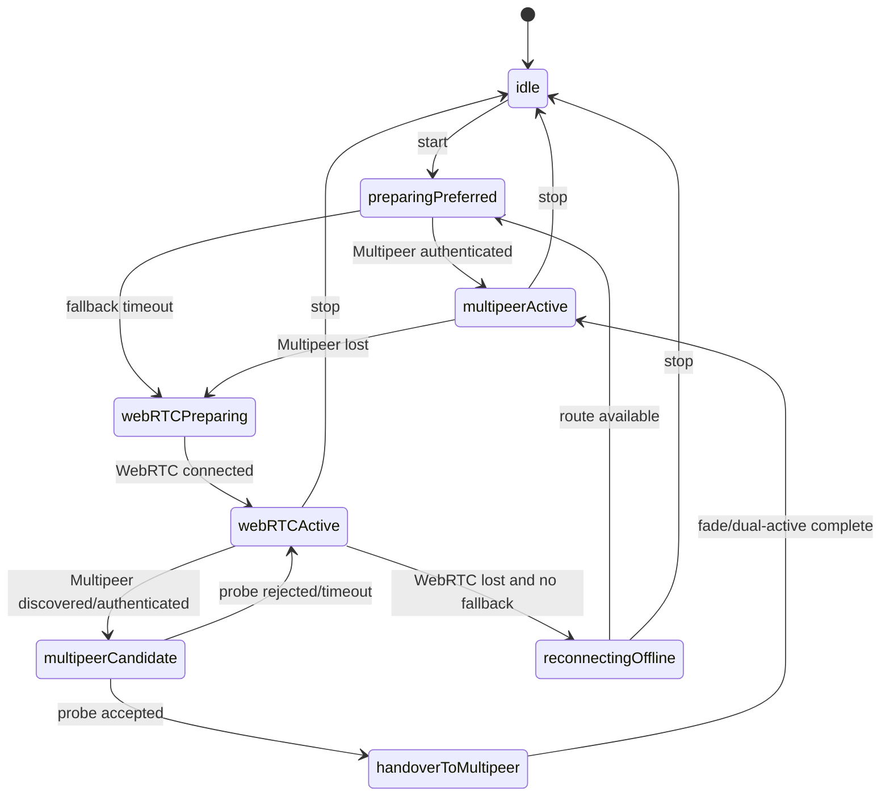
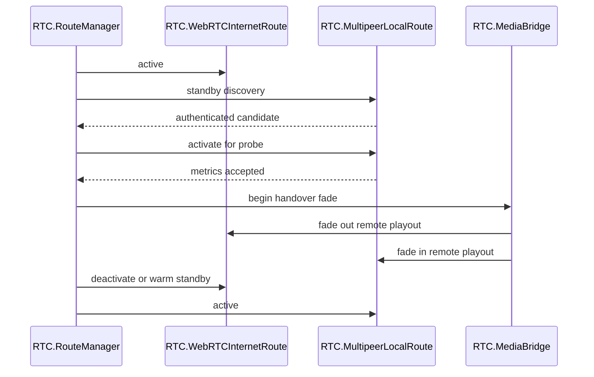

# RideIntercom アーキテクチャ設計

## 目的

本書は、RideIntercom の通話基盤を `MultipeerConnectivity` と WebRTC MediaStream の両方に対応できる形へ再設計するためのアーキテクチャ方針を定義する。

通話経路の制御と抽象 I/F は、アプリ本体ではなく Swift Package `RTC` に置く。RideIntercom は `RTC` を利用するアプリケーションとして、グループ、認証 secret、UI、音声デバイス選択、診断表示を担当する。

現行 Core は `IntercomViewModel` が音声処理、接続状態、経路制御、`Transport` 送受信を広く担っている。今後 WebRTC MediaStream を採用する場合、WebRTC は単なるデータ配送ではなく音声 capture / encode / jitter / playout を含む media plane を持つため、既存の `Transport` 抽象だけで同一視すると責務が崩れる。

そのため Core からは「単一の通話セッション」に見せ、内部で経路ごとの media 実装差を `RTC` パッケージが吸収する。

## 設計原則

| 原則 | 内容 |
|---|---|
| Core は通話意図だけを扱う | Core は `start`, `stop`, `mute`, `device selection`, `member state` を扱い、経路固有の送信処理を持たない |
| 抽象 I/F は `RTC` に置く | `CallSession`, `RouteManager`, route 抽象、route event、capability、設定は `RTC` の public API とする |
| Transport と Media を分ける | discovery / signaling / control と、音声 capture / encode / playout を別責務として扱う |
| Multipeer を優先する | 近距離・低遅延・オフライン動作を優先し、WebRTC は広域 fallback とする |
| WebRTC MediaStream を尊重する | WebRTC は DataChannel だけに押し込まず、音声本体は MediaStream / RTP / SRTP を使う |
| 自動復帰を標準動作にする | WebRTC 利用中も Multipeer discovery を継続し、復帰可能なら Multipeer へ戻す |
| 設定で経路を無効化できる | Multipeer only, WebRTC only, hybrid を構成可能にする |
| 将来の transport 追加に備える | 新経路は `RTC` の `RTCCallRoute` として追加し、RideIntercom Core API を増やさない |

## 全体構成



## レイヤ責務

| レイヤ | 主な型 | 責務 |
|---|---|---|
| UI | `ContentView` | 表示、操作入力、診断表示 |
| Core | `IntercomViewModel` | グループ、メンバー、ユーザー操作、状態表示 |
| App adapter | `RideIntercomCallSessionAdapter` | RideIntercom 型と `RTC` 型の変換、音声 policy の接続 |
| RTC session | `RTC.CallSession` | アプリ向けの単一通話 API、経路と media の統合 |
| RTC route manager | `RTC.RouteManager` | 優先経路、fallback、自動復帰、handover |
| RTC route 実装 | `RTC.MultipeerLocalRoute`, `RTC.WebRTCInternetRoute` | 経路固有の接続、認証、media 制御 |
| RTC media bridge | `RTC.MediaBridge` | route ごとの media 入出力を抽象化する。WebRTC MediaStream と app-managed packet audio の差分を吸収 |
| Signaling | `RTC.WebRTCSignalingClient` | offer / answer / ICE / 参加者制御 |

## `RTC` パッケージ境界

`RTC` は RideIntercom から独立した通信制御ライブラリとして扱う。アプリ固有の `IntercomGroup`, `GroupMember`, `LocalMemberIdentity`, `AudioPortInfo` は `RTC` の public API に入れない。

| `RTC` に置く | RideIntercom に残す |
|---|---|
| session / route / peer / event / metrics / capabilities / route policy | group persistence、invite URL、group secret 管理、UI 表示、音声デバイス UI |
| Multipeer route の lifecycle 制御 | RideIntercom の group hash / access secret の生成 |
| WebRTC route の lifecycle 制御 | Cloudflare token 発行 API の呼び出し方針 |
| route selection / fallback / restore / handover | 診断表示への文言変換 |
| media bridge 抽象 | 実際の `AudioSessionManager` や UI 操作 |

`RTC` は platform API を直接 import する route 実装を持ってよい。ただし public I/F は platform 固有型に寄せすぎない。

```text
RTC
  Sources/RTC
    CallSession.swift
    RouteManager.swift
    RouteTypes.swift
    MultipeerLocalRoute.swift
    WebRTCInternetRoute.swift
    MediaBridge.swift
    WebRTCSignalingClient.swift
```

## Core から見える API

Core は transport を直接持たず、`RTC.CallSession` またはそれを包む `RideIntercomCallSessionAdapter` のみを保持する。

```swift
protocol CallSession: AnyObject {
    var events: AsyncStream<CallSessionEvent> { get }

    func start(_ request: CallStartRequest) async
    func stop() async

    func setLocalMute(_ muted: Bool) async
    func setOutputMute(_ muted: Bool) async
    func setRemoteOutputVolume(peerID: PeerID, volume: Float) async
}
```

`RTC` が受け取る request はアプリ固有型を持たない。

```swift
public struct CallStartRequest: Sendable, Equatable {
    public var sessionID: String
    public var localPeer: PeerDescriptor
    public var expectedPeers: [PeerDescriptor]
    public var credential: RTCCredential?
    public var configuration: CallRouteConfiguration
}

public struct PeerDescriptor: Sendable, Equatable, Hashable {
    public var id: PeerID
    public var displayName: String
}

public struct PeerID: RawRepresentable, Hashable, Codable, Sendable {
    public var rawValue: String
}

public struct RTCCredential: Sendable, Equatable {
    public var groupHash: String
    public var sharedSecret: Data
}
```

Core へ返す event は route 固有情報を正規化する。

```swift
public enum CallSessionEvent: Sendable, Equatable {
    case stateChanged(CallConnectionState)
    case membersChanged([CallMemberState])
    case routeChanged(ActiveRouteSnapshot)
    case routeAvailabilityChanged([RouteAvailability])
    case localAudioLevelChanged(AudioLevel)
    case remoteAudioLevelChanged(peerID: PeerID, AudioLevel)
    case error(CallSessionError)
}
```

RideIntercom 側の adapter は `IntercomGroup` から `CallStartRequest` を作り、`CallSessionEvent` を `IntercomViewModel` の表示状態へ反映する。

## Control Plane と Media Plane

WebRTC MediaStream を使う場合、control と media を明確に分ける。

| Plane | Multipeer | WebRTC |
|---|---|---|
| discovery | `MCNearbyServiceAdvertiser`, `MCNearbyServiceBrowser` | signaling server 上の room / participant |
| authentication | group hash + handshake MAC | server-issued participant token + app-level group credential |
| control | reliable `MCSession.send` | `RTCDataChannel` または signaling |
| audio media | encrypted packet over `MCSession` | `RTCAudioTrack` over RTP/SRTP |
| keepalive / metrics | control packet / packet timestamps | DataChannel ping + WebRTC stats |
| playout | app-managed jitter buffer + mixer | WebRTC internal playout、または将来 custom sink |

追加方針:

| 項目 | 方針 |
|---|---|
| 接続 I/F と音声 I/F | 分ける。接続成立だけで mic / playout を起動しない |
| metadata/control | Control Plane の責務として、Media Plane 起動前でも送受信可能にする |
| 音声開始条件 | peer 認証完了後、または route が media ready を通知した後 |
| 音声停止条件 | 明示的 stop、route 切替、切断時 |
| Core からの見え方 | 「接続済みだが音声未開始」の状態を正式に持つ |

### 想定する新しい抽象境界

```swift
protocol ConnectionSession: AnyObject {
    var onEvent: (@MainActor (TransportEvent) -> Void)? { get set }

    func startStandby(group: CallGroup)
    func connect(group: CallGroup)
    func disconnect()
    func sendControl(_ message: ControlMessage)
}

protocol MediaSession: AnyObject {
    func startMedia()
    func stopMedia()
    func sendAudioFrame(_ frame: OutboundAudioPacket)
}
```

`RTC.CallSession` は app 向け façade として残しつつ、内部では `ConnectionSession` と `MediaSession` を束ねる。`RouteManager` は Control Plane の active route を先に決め、Media Plane の start/stop は認証状態に応じて別に管理する。

## Route 抽象

`RTCCallRoute` は Core API ではなく、`RTC.RouteManager` 内部の plugin 境界とする。

```swift
public enum RouteKind: String, CaseIterable, Codable, Sendable {
    case multipeer
    case webRTC
}

public struct RouteCapabilities: Equatable, Sendable {
    var supportsLocalDiscovery: Bool
    var supportsOfflineOperation: Bool
    var supportsManagedMediaStream: Bool
    var supportsAppManagedPacketMedia: Bool
    var supportsReliableControl: Bool
    var supportsUnreliableControl: Bool
    var requiresSignaling: Bool
}

public protocol RTCCallRoute: AnyObject {
    var kind: RouteKind { get }
    var priority: Int { get }
    var capabilities: RouteCapabilities { get }
    var events: AsyncStream<RouteEvent> { get }

    func prepare(_ request: CallStartRequest) async
    func activateConnection() async
    func deactivateConnection() async
    func startMedia() async
    func stopMedia() async
    func stop() async

    func setLocalMute(_ muted: Bool) async
    func setOutputMute(_ muted: Bool) async
    func setRemoteOutputVolume(peerID: PeerID, volume: Float) async
}
```

`RTC.RouteManager` は `RTCCallRoute` の event を集約し、active route を決める。RideIntercom は route の実体を直接操作しない。

補足: `activateConnection()` は discovery / invite / signaling / handshake を開始する。`startMedia()` はその後段で音声面だけを上げる。

## `RTC.MultipeerLocalRoute`

`RTC.MultipeerLocalRoute` は現行 `MultipeerLocalTransport` と既存音声処理を再配置した経路である。RideIntercom から見ると local primary route だが、実装は `RTC` パッケージ内に移す。


責務:

| 項目 | 内容 |
|---|---|
| discovery / invite | group hash を `discoveryInfo` に載せて同一グループ候補のみ invite |
| handshake | group secret 由来 MAC で認証 |
| control metadata | mute state, keepalive, peer state を control payload で流す |
| media | app-managed packet audio。認証完了後にだけ開始する |
| 暗号 | group secret 由来鍵で audio payload を暗号化 |
| 診断 | packet loss, jitter, peer count, local network status |

分離方針:

| 層 | 役割 |
|---|---|
| `MultipeerConnectionTransport` | advertiser / browser / MCSession 接続 / invite / handshake / control payload |
| `MultipeerPacketMediaSession` | sequencer / audio payload build / receive filter / jitter / media state |
| `MultipeerLocalRoute` | 上記 2 つを束ね、route event と lifecycle を公開 |

`MultipeerConnectivity` は Apple platform 依存なので、`RTC.MultipeerLocalRoute` は `canImport(MultipeerConnectivity)` の範囲で提供する。platform 非対応時は route factory で利用不可として扱い、dummy route は作らない。

## `RTC.WebRTCInternetRoute`

`RTC.WebRTCInternetRoute` は WebRTC MediaStream を広域 fallback として使う。現時点では未実装だが、`RTC` の route 抽象上は Multipeer と同じ lifecycle で扱う。



責務:

| 項目 | 内容 |
|---|---|
| signaling | meeting / participant / offer / answer / ICE |
| media | `RTCAudioTrack` を publish / subscribe |
| control | DataChannel で mute, metadata, ping, route probe |
| security | DTLS-SRTP と provider token。必要に応じて app-level group credential を control に載せる |
| 診断 | WebRTC stats から RTT, jitter, packet loss, selected candidate pair を取得 |

WebRTC では音声本体を既存 `AudioPacketEnvelope` に変換しない。`AudioPacketEnvelope` は `RTC.MultipeerLocalRoute` の内部実装として残す。

## `RTC.WebRTCSignalingClient`

signaling は WebRTC media と別責務にする。

```swift
public protocol WebRTCSignalingClient: AnyObject {
    var events: AsyncStream<WebRTCSignalingEvent> { get }

    func connect(_ request: WebRTCSignalingConnectRequest) async
    func disconnect() async

    func sendOffer(_ offer: WebRTCSessionDescription, to peerID: PeerID) async
    func sendAnswer(_ answer: WebRTCSessionDescription, to peerID: PeerID) async
    func sendCandidate(_ candidate: WebRTCIceCandidate, to peerID: PeerID) async
    func sendControl(_ message: WebRTCControlMessage, to peerID: PeerID?) async
}
```

WebRTCInternetRoute の signaling は、Cloudflare RealtimeKit Core SDK または専用 server signaling として扱い、Core からは `WebRTCSignalingClient` の抽象越しに見る。

`RTC` の public API では native WebRTC SDK の型を直接露出しない。`RTCSessionDescription` や `RTCIceCandidate` 相当は `WebRTCSessionDescription`, `WebRTCIceCandidate` に包み、WebKit / native SDK / Cloudflare SDK の差分を実装層に閉じ込める。

## `RTC.RouteManager`

### 状態遷移



### 優先ルール

| 条件 | 動作 |
|---|---|
| Multipeer が有効かつ認証済み | Multipeer を active route にする |
| Multipeer が未成立で WebRTC が有効 | fallback delay 後に WebRTC を開始 |
| WebRTC active 中に Multipeer が復帰 | probe 後に Multipeer へ handover |
| handover 中 | 両 route を短時間 active にし、音声出力を fade で切り替える |
| WebRTC only 設定 | Multipeer standby を開始しない |
| Multipeer only 設定 | WebRTC signaling を開始しない |

`RTC.RouteManager` は `CallRouteConfiguration` を受け取り、利用可能な route factory から route を生成する。disabled route は生成しない。これにより、片側 route の event が混入して Core 状態を壊すことを防ぐ。

### Handover 方針

WebRTC MediaStream と Multipeer packet media は playout 経路が異なるため、単純な dual-send だけではなく「出力経路の切替」を扱う。



初期実装では次の制御で十分とする。

| フェーズ | WebRTC | Multipeer |
|---|---|---|
| WebRTC active | playout enabled | discovery only / playout muted |
| handover | fade out | fade in |
| Multipeer active | warm standby または stopped | playout enabled |

将来的に WebRTC remote audio を custom audio sink で取り出せる場合、`RTC.MediaBridge` の mixer に統合し、peer ごとの音量・meter・mute を完全に共通化する。

`RTC` パッケージ上ではこの責務を `MediaBridge` として抽象化する。RideIntercom は当面 app-managed packet audio の capture/playout を持ち続けてもよいが、route handover の判断と状態管理は `RTC.RouteManager` に寄せる。

## 設定

```swift
public struct CallRouteConfiguration: Codable, Equatable, Sendable {
    var enabledRoutes: Set<RouteKind> = [.multipeer, .webRTC]
    var preferredRoute: RouteKind = .multipeer

    var automaticFallbackEnabled = true
    var automaticRestoreToPreferredEnabled = true

    var multipeerStandbyEnabled = true
    var webRTCWarmStandbyEnabled = true

    var fallbackDelay: TimeInterval = 3.0
    var restoreProbeDuration: TimeInterval = 7.5
    var handoverFadeDuration: TimeInterval = 0.35
}
```

| モード | `enabledRoutes` | `preferredRoute` | 備考 |
|---|---|---|---|
| Hybrid | `[.multipeer, .webRTC]` | `.multipeer` | 標準。Multipeer 優先、WebRTC fallback |
| Multipeer only | `[.multipeer]` | `.multipeer` | オフライン・近距離専用 |
| WebRTC only | `[.webRTC]` | `.webRTC` | 広域接続専用。Multipeer discovery も停止 |

disabled route は生成しない。`NullRoute` で見かけ上存在させると、誤 event や診断値の混入が起きやすい。

RideIntercom 側の設定画面や環境変数は、この `RTC.CallRouteConfiguration` を生成するだけに留める。`RTC` は永続化方法を持たない。

## WebRTC 実装候補の比較

2026-04-24 時点では、WebRTC Internet route の実装候補を以下の2つに絞る。

1. WebKit WebRTC + Cloudflare Realtime SFU/TURN
2. Native WebRTC SDK + Cloudflare Realtime SFU/TURN

Cloudflare Realtime は、高レベル SDK である RealtimeKit とは別に、低レベルの Realtime SFU と managed TURN Service を提供する。Realtime SFU は raw WebRTC を前提にした media server であり、SDK や room 抽象を提供せず、session / track / presence は利用側が設計する。TURN Service は WebRTC client が NAT / firewall を越えるための managed relay として使う。

### 比較表

| 観点 | WebKit + Cloudflare SFU/TURN | Native WebRTC SDK + Cloudflare SFU/TURN |
|---|---|---|
| client 実装 | `WKWebView` 内の JavaScript WebRTC API | Swift から native WebRTC SDK / libwebrtc を操作 |
| SFU/TURN | Cloudflare Realtime SFU + TURN Service | Cloudflare Realtime SFU + TURN Service |
| RTC public API との相性 | JS bridge が必要。`RTC` public API と WebView 内 state の二重管理になりやすい | 良い。`RTC.WebRTCInternetRoute` の実装として直接組み込みやすい |
| audio session / device | 弱い。WebView 内 capture/playout と `AVAudioSession` 制御の整合が難しい | 強い。`AVAudioSession`, CallKit, background audio と統合しやすい |
| Multipeer handover | 難しい。WebView playout と native Multipeer playout の fade / mute / meter 統合が課題 | 比較的やりやすい。`RTC.MediaBridge` と route state に寄せられる |
| stats / diagnostics | JS `getStats()` を bridge して `RTC.RouteMetrics` へ変換する必要がある | native WebRTC stats を `RTC.RouteMetrics` へ直接変換できる |
| 開発速度 | Web 実装があるなら速い。native bridge と権限検証で詰まりやすい | 初期実装は重い。完成後の保守性と制御性は高い |
| WebRTC 標準 API との近さ | 高い。browser WebRTC に近い | 中。libwebrtc API に依存する |
| ベンダーロックイン | Cloudflare SFU/TURN と WebKit 挙動に依存 | Cloudflare SFU/TURN と選定 SDK に依存 |
| 本番通話 UX | リスク高。background、Bluetooth、speaker route、mute UX の検証が重い | 有力。intercom として自然な native UX に寄せやすい |

### WebKit + Cloudflare Realtime SFU/TURN の Pros

| Pros | 内容 |
|---|---|
| Cloudflare の低レベル WebRTC 基盤を使える | Realtime SFU は raw WebRTC を前提にした低レベル media server として提供され、room 抽象に縛られにくい |
| TURN を managed service にできる | Cloudflare Realtime TURN Service により、NAT / firewall 配下でも接続性を確保しやすい |
| WebRTC 標準 API に近い | client は WebKit の `RTCPeerConnection` / MediaStream / DataChannel を使うため、SDK 固有 API への依存を抑えやすい |
| SFU/TURN の運用を持たなくてよい | グローバル edge と anycast による近傍接続を Cloudflare 側に任せられる |
| 低レベル制御を維持できる | RealtimeKit の meeting / participant など高レベル SDK 概念に合わせず、`RTC` 側で route / presence を設計しやすい |

### WebKit + Cloudflare Realtime SFU/TURN の Cons

| Cons | 内容 |
|---|---|
| native 統合の課題は残る | WebKit 利用なので、audio session、入出力デバイス、background、CallKit、Multipeer handover の難しさは解消しない |
| signaling / presence は自前設計 | Cloudflare Realtime SFU は低レベル寄りのため、参加者管理、token、track 管理、再接続 state machine を RideIntercom 側で設計する必要がある |
| `RTC` との bridge が太い | mute、member state、stats、route state を JS bridge で往復させる必要がある |
| WebKit 挙動に依存する | iOS / macOS、Safari / `WKWebView`、OS version ごとの差分検証が必要 |
| Cloudflare 到達性が前提 | 屋外・圏外・山岳などでは fallback にはなるが、Local primary の代替にはならない |
| 音声 UX の一体化が難しい | WebView 内 playout と native Multipeer playout の fade / mute / volume / meter を統一しづらい |

### Native WebRTC SDK + Cloudflare Realtime SFU/TURN の Pros

| Pros | 内容 |
|---|---|
| `RTC.WebRTCInternetRoute` と相性が良い | route lifecycle、stats、mute、DataChannel、handover を Swift 側で直接制御できる |
| native audio UX に寄せやすい | `AVAudioSession`、Bluetooth、speaker route、background audio、CallKit との統合余地が大きい |
| Cloudflare SFU/TURN を低レベルに使える | SFU/TURN 運用を Cloudflare に寄せつつ、client と signaling/presence は `RTC` 側で設計できる |
| Multipeer との handover を設計しやすい | WebRTC route と Multipeer route を同じ `RTC.RouteManager` / `RTC.MediaBridge` に乗せられる |
| WebView bridge が不要 | state の二重管理を避け、診断値や route event を直接生成できる |

### Native WebRTC SDK + Cloudflare Realtime SFU/TURN の Cons

| Cons | 内容 |
|---|---|
| 初期実装が重い | PeerConnection、transceiver、ICE、stats、DataChannel、reconnect を実装・検証する必要がある |
| native WebRTC SDK の選定リスク | binary 配布、ライセンス、更新頻度、OS 互換、ビルドサイズを確認する必要がある |
| Cloudflare low-level API の理解が必要 | Realtime SFU は unopinionated なので、room / presence / track ownership を自前で設計する |
| app store / privacy 検証が必要 | microphone、background、network relay、diagnostics の説明責務がある |
| route 間 media 統合は依然難しい | WebRTC playout を custom sink に寄せるか、route ごとの playout を fade で切り替えるかを決める必要がある |

### `stasel/WebRTC` の位置づけ

`stasel/WebRTC` は native WebRTC SDK 候補として扱う。Swift Package Index では、iOS / macOS 向けの up-to-date WebRTC framework binaries を community-driven に配布する package とされ、2026-04-08 時点の latest release は `147.0.0` である。GitHub README では、公式 WebRTC source からビルドされた iOS / macOS / macOS Catalyst 向け xcframework として説明されている。

| 観点 | 評価 |
|---|---|
| 用途適合 | `Native WebRTC SDK + Cloudflare Realtime SFU/TURN` 案の native WebRTC layer として使える可能性が高い |
| 導入 | Swift Package Manager で導入できる。product は `WebRTC` |
| 対応 platform | iOS、macOS、macOS Catalyst の binary が提供されている |
| 強み | 自前で libwebrtc をビルドせずに native WebRTC API を使える |
| 注意 | binary-only package なので、供給元の更新継続、署名、ライセンス、サイズ、CI cache、Swift 6 data race safety とは別の runtime 品質を確認する |
| 検証項目 | `RTCPeerConnectionFactory`, audio track, DataChannel, ICE server 設定、Cloudflare TURN credentials、SFU publish/subscribe、stats 取得、background audio |

## 推奨判断

現時点の推奨は次の順で検証すること。

| 優先 | 方針 | 理由 |
|---|---|---|
| 1 | Native WebRTC SDK + Cloudflare Realtime SFU/TURN を本命 PoC にする | `RTC` の route abstraction、native audio UX、Multipeer handover に最も合わせやすい |
| 2 | `stasel/WebRTC` を native SDK 候補として検証する | SPM で導入可能な iOS/macOS 向け WebRTC binary distribution で、自前ビルドを避けられる |
| 3 | WebKit + Cloudflare SFU/TURN を比較 PoC にする | raw WebRTC 制御はできるが、WebView 境界が本番通話 UX のリスクになる |
| 4 | WebKit 案は prototype / fallback research に限定する | background、audio session、handover、diagnostics の統合リスクが大きい |

WebKit WebRTC は「Web app をそのまま埋める」には魅力があるが、RideIntercom の要求である Multipeer 優先、自動復帰、自然な handover、音声デバイス制御、診断統合を考えると、本番通話経路の第一候補にはしにくい。

Native WebRTC SDK + Cloudflare Realtime SFU/TURN は初期実装が重いが、`RTC.CallSession` / `RTC.RouteManager` / `RTCCallRoute` 境界を守りやすい。Cloudflare Realtime SFU/TURN は低レベル基盤として使い、RideIntercom 固有の route selection / presence / handover は `RTC` 側で制御する。

WebKit + Cloudflare Realtime SFU/TURN は、低レベル制御と managed SFU/TURN の両方を得られるため技術的には有力に見える。ただし RideIntercom の主用途では、MultipeerLocalRoute との handover、native audio session、background 通話 UX が重要であり、WebView 境界が大きなリスクになる。そのため本番候補としては、同じ Cloudflare SFU/TURN を使う場合でも native WebRTC SDK と組み合わせる案を優先する。

## 移行計画

### Phase 1: `RTC` public I/F の定義

| 作業 | 内容 |
|---|---|
| `RTC.CallSession` 追加 | RideIntercom Core から通信・音声開始停止を呼ぶ単一 API を作る |
| `RTC.CallSessionEvent` 追加 | 接続、route、member、audio level、error を正規化する |
| `RTC.CallRouteConfiguration` 追加 | enabled route, preferred route, fallback / restore policy を表現する |
| `RideIntercomCallSessionAdapter` 追加 | `IntercomGroup` / `LocalMemberIdentity` を `RTC.CallStartRequest` に変換する |

### Phase 2: `RTC.MultipeerLocalRoute` 化

| 作業 | 内容 |
|---|---|
| `RTC.MultipeerLocalRoute` 追加 | 現行 `MultipeerLocalTransport` と packet media を `RTC` の route 実装へ移す |
| connection / media 分離 | Multipeer の discovery / handshake / control と packet audio を別コンポーネントへ分ける |
| local standby 移動 | group 選択時の discovery 待受を `RTC.RouteManager` へ移す |
| diagnostics 維持 | 現行 `LocalNetworkStatus` は `RouteAvailability` として引き継ぐ |

### Phase 3: `RTC.RouteManager` 化

| 作業 | 内容 |
|---|---|
| `RTC.RouteManager` 追加 | 現行 `RouteCoordinator` を発展させて route lifecycle を管理 |
| fallback 実装 | Multipeer 不成立時に WebRTC route を開始 |
| restore 実装 | WebRTC active 中も Multipeer candidate を監視 |

### Phase 4: `RTC.WebRTCInternetRoute` PoC

| 作業 | 内容 |
|---|---|
| SDK 選定 PoC | `stasel/WebRTC` + Cloudflare Realtime SFU/TURN を優先検証し、WebKit + Cloudflare SFU/TURN と比較する |
| audio-only 接続 | camera 無し、microphone のみで meeting に参加 |
| control 同期 | mute / member state / route ping を DataChannel または SDK event で同期 |
| stats 取得 | RTT, jitter, packet loss, reconnect event を route metrics に変換 |

### Phase 5: Handover

| 作業 | 内容 |
|---|---|
| dual-active 制御 | WebRTC と Multipeer を短時間同時 active にする |
| fade 制御 | WebRTC playout fade out、Multipeer playout fade in |
| warm standby | handover 後の WebRTC 維持時間を設定可能にする |

## テスト方針

`RTC` パッケージでは route manager と event 正規化を中心に単体テストを書く。RideIntercom 側では adapter と UI 状態反映をテストする。

| テスト | 期待 |
|---|---|
| Multipeer only | WebRTC signaling が開始されない |
| WebRTC only | Multipeer discovery が開始されない |
| Hybrid 初期接続 | Multipeer が成立すれば WebRTC に進まない |
| Multipeer 不成立 | fallback delay 後に WebRTC を開始する |
| WebRTC active 中の Multipeer 復帰 | probe 後に handover へ入る |
| handover 完了 | active route が Multipeer へ戻る |
| WebRTC 切断 | Multipeer がなければ reconnecting/offline へ遷移 |
| disabled route event | 無効経路の event で Core 状態が変化しない |
| mute sync | active route に関係なく remote mute state が一致する |
| audio device change | active route ごとの device 制御が破綻しない |

| テスト対象 | 配置 |
|---|---|
| route selection / fallback / restore / disabled route | `RTC/Tests/RTCTests` |
| fake Multipeer route / fake WebRTC route event の集約 | `RTC/Tests/RTCTests` |
| `IntercomGroup` から `RTC.CallStartRequest` への変換 | `RideIntercomTests` |
| diagnostics summary / UI 文言 | `RideIntercomTests` |

## 参照情報

| 項目 | URL |
|---|---|
| Cloudflare RealtimeKit overview | https://developers.cloudflare.com/realtime/realtimekit/ |
| Cloudflare RealtimeKit iOS Core quickstart | https://docs.realtime.cloudflare.com/ios-core |
| Cloudflare RealtimeKit supported platforms | https://docs.realtime.cloudflare.com/getting-started |
| Cloudflare Realtime product page | https://www.cloudflare.com/developer-platform/products/cloudflare-realtime/ |
| Cloudflare Realtime overview | https://developers.cloudflare.com/realtime/ |
| Cloudflare Realtime SFU introduction | https://developers.cloudflare.com/realtime/sfu/introduction/ |
| Cloudflare Realtime TURN Service | https://developers.cloudflare.com/realtime/turn/ |
| stasel/WebRTC Swift Package Index | https://swiftpackageindex.com/stasel/WebRTC |
| stasel/WebRTC GitHub | https://github.com/stasel/WebRTC |
| Apple Safari release notes WebRTC updates | https://developer.apple.com/documentation/safari-release-notes/safari-26_4-release-notes |
| Apple AVAudioEngine voice processing | https://developer.apple.com/documentation/avfaudio/using-voice-processing |
| Apple microphone / AVAudioEngine guidance | https://developer.apple.com/documentation/shazamkit/matching-audio-using-the-built-in-microphone |
