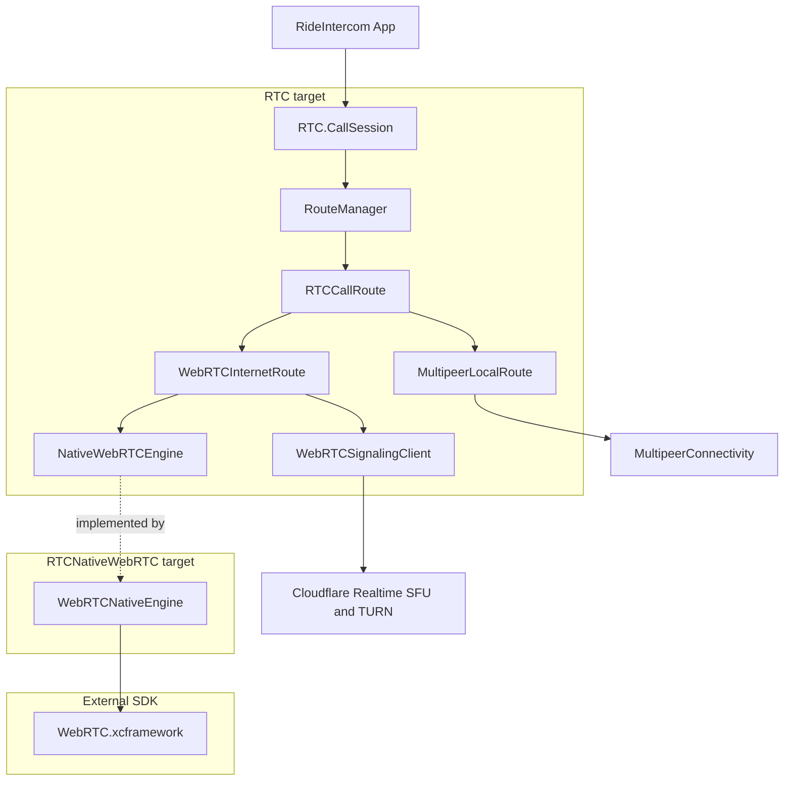
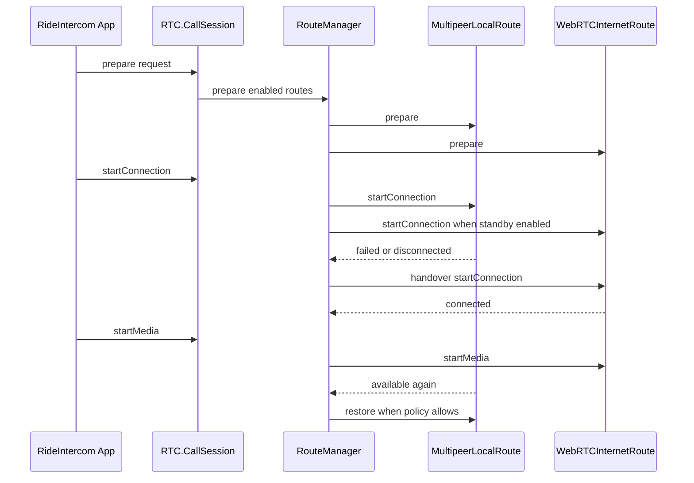

# RTC パッケージ仕様

## 目的

`RTC` は RideIntercom の通話経路を統合する Swift Package として、近距離の `MultipeerConnectivity` と広域の WebRTC を同じ `CallSession` から扱えるようにする。

アプリ本体は UI、グループ管理、secret 管理、音声デバイス選択、診断表示を担当する。`RTC` は接続、経路選択、handover、アプリデータ配送、経路ごとの音声 media 起動停止を担当する。

本パッケージが接続方式差異の全て吸収する。アプリは全く同じ処理を接続方式の区別なく呼び出すことが可能になる。本パッケージは呼び出された接続方式固有処理を無視して取り扱うことが可能。

## 採用方針

| 項目 | 方針 |
|---|---|
| 近距離経路 | `MultipeerConnectivity` を使用する。オフライン動作と低遅延を優先する |
| 広域経路 | native WebRTC SDK を使用する。Cloudflare Realtime SFU and TURN services を前提にする |
| WebRTC public API | `RTC` の public API に native WebRTC 型を露出しない |
| WebRTC 実装配置 | 共通 `RTC` target から分離し、native WebRTC adapter target に閉じ込める |
| WebRTC binary供給 | `webrtc.googlesource.com/src` から自前ビルドした `WebRTC.xcframework` をlocal binary targetとして取り込む |
| サポートOS | RideIntercom本体と同じ最新OSのみを対象にし、iOSとmacOSの最低deployment targetを `26.4` に揃える。Mac CatalystとvisionOSは対象外にする |
| ビルド caveat | native WebRTC binary framework は SwiftPM 単体テストで header 解決に失敗する場合がある。共通 `RTC` target はSDK非依存でテスト可能に保つ |

## パッケージ構成

| パス | 役割 | 代表型 |
|---|---|---|
| `Sources/RTC/Core` | アプリ向けの共通 contract | `CallSession`, `CallStartRequest`, `PeerDescriptor`, `RTCCredential`, `ApplicationDataMessage`, `AudioFrame` |
| `Sources/RTC/Routing` | 経路 plugin 境界と自動切替 | `RTCCallRoute`, `RouteManager`, `AnyRouteFactory`, `UnavailableCallSession` |
| `Sources/RTC/PacketAudio` | Multipeer 用 packet audio と wire payload | `PCMAudioCodec`, `PacketAudioEnvelope`, `PacketCrypto`, `MultipeerWireMessage` |
| `Sources/RTC/Multipeer` | 近距離 route 実装 | `MultipeerLocalRoute`, `MultipeerConnectionTransport`, `MultipeerPacketMediaSession` |
| `Sources/RTC/WebRTC` | WebRTC 共通 contract と Cloudflare signaling 境界 | `WebRTCInternetRoute`, `NativeWebRTCEngine`, `CloudflareRealtimeConfiguration`, `WebRTCSignalingClient` |
| `Sources/RTC/Support` | 小さな共通補助 | `EventSource` |
| `Sources/RTCNativeWebRTC` | native WebRTC adapter | `WebRTCNativeEngine` |

## アプリとの責務境界

| 領域 | RideIntercom App | RTC |
|---|---|---|
| UI | 表示、操作、アクセシビリティ、診断画面 | UIを持たない |
| グループ | group ID、secret、表示名、招待導線を管理 | `RTCCredential` と `PeerDescriptor` だけを受け取る |
| 音声デバイス | 入出力デバイス選択、OS permission、アプリ側音声処理 | routeごとの media lifecycle を制御する |
| Multipeer 音声 | `AudioFrame` を生成して `sendAudioFrame` に渡す | packet化、暗号化、送信、受信filterを担当する |
| WebRTC 音声 | WebRTC経路ではサンプル送信をしない | `RTCAudioTrack` の有効化と peer connection を担当する |
| アプリデータ | namespace と payload schema を定義する | binary payload と配送信頼性だけを扱う |
| 接続設定 | ユーザー設定から有効routeを決める | `CallRouteConfiguration` に従って選択とhandoverを行う |

## 公開 contract

| 型 | 説明 |
|---|---|
| `CallSession` | アプリが保持する単一の通話 facade。接続とmedia lifecycleを分けて操作する |
| `CallStartRequest` | local peer、期待peer、credential、audio format、route設定を渡す |
| `CallRouteConfiguration` | 有効route、優先route、fallback、自動復帰、standby/warm設定を定義する |
| `CallSessionEvent` | 接続状態、route状態、member、metrics、application data、errorを通知する |
| `RTCCallRoute` | `RouteManager` が扱う経路plugin境界。アプリは直接保持しない |
| `NativeWebRTCEngine` | `WebRTCInternetRoute` が使うWebRTC engine抽象。native SDK型を隠す |

## 接続とmediaの分離

| lifecycle | 意味 | Multipeer | WebRTC |
|---|---|---|---|
| `prepare` | credential、peer、audio format、route設定を受け取る | advertiser/browser準備 | signalingとengine準備 |
| `startConnection` | control planeを開始する | discovery、invite、handshake | Cloudflare signaling接続、room参加 |
| `startMedia` | 音声mediaを開始する | packet audioを送受信可能にする | `RTCAudioTrack` を有効化する |
| `stopMedia` | 音声mediaだけ停止する | packet audio送受信を止める | `RTCAudioTrack` を無効化する |
| `stopConnection` | route接続を終了する | `MCSession` と discovery を終了する | signalingとpeer connectionを終了する |

接続済みでもmedia未開始の状態を正式な状態として扱う。これにより、接続準備、認証、member同期、アプリデータ配送を音声開始より先に成立させられる。

## Control Plane と Media Plane

| 種別 | Multipeer | WebRTC |
|---|---|---|
| discovery | Bonjour service `ride-intercom` | Cloudflare room / participant |
| 認証 | group hash と HMAC handshake | Cloudflare participant token と app-level credential |
| route内部control | `MultipeerWireMessage.control` | signaling または DataChannel |
| アプリデータ | `MultipeerWireMessage.applicationData` | `RTCDataChannel`、失敗時は signaling fallback |
| 音声media | `MultipeerWireMessage.packetAudio` | RTP/SRTP media stream |
| 音声codec | アプリ管理のPCM packetから開始し、将来差し替え可能 | WebRTC native codec selection |

`ApplicationDataMessage` は namespace、payload、配送信頼性だけを持つ。RTC内部の handshake、keepalive、fallback diagnostics はアプリデータに混ぜない。

## 音声責務

| 経路 | `AudioMediaOwnership` | アプリから `sendAudioFrame` | RTC側責務 |
|---|---|---|---|
| Multipeer | `appManagedPacketAudio` | 使用する | encode、encrypt、sequence、receive filter、send/receive |
| WebRTC | `routeManagedMediaStream` | 使用しない | `RTCAudioTrack`、peer connection、DataChannel、stats取得境界 |

`RouteManager` は active route が `appManagedPacketAudio` を持つ場合だけ `sendAudioFrame` を転送する。WebRTC active時にアプリが `sendAudioFrame` を呼んでも、音声サンプルは route に渡さない。

## 経路選択

| 設定 | 意味 |
|---|---|
| `enabledRoutes` | ユーザー設定で opt-in / opt-out されたrouteだけを使用する |
| `preferredRoute` | 最初に接続するroute。通常は `.multipeer` |
| `selectionMode.singleRoute` | 優先routeだけを使う |
| `selectionMode.automaticFallback` | 優先routeが失敗したら別routeへ切り替える |
| `selectionMode.automaticFallbackAndRestore` | fallback後も優先routeを監視し、復帰可能なら戻す |
| `startsStandbyConnections` | fallback候補routeを接続standbyまで進める |
| `keepsPreviousRouteWarmDuringHandover` | handover中に旧routeを即切断せず、media fade後に停止する |

## Multipeer route

| 項目 | 仕様 |
|---|---|
| service type | `ride-intercom` |
| discovery info | `groupHash` を含める |
| invite context | `groupHash` を含める |
| handshake | `RouteHandshakeMessage` を HMAC-SHA256 で検証する |
| payload | `MultipeerWireMessage` で control / application data / packet audio を分離する |
| 暗号化 | packet audio payload は `RTCCredential.sharedSecret` から AES-GCM で保護する |
| media開始前 | control と handshake は可能。packet audioは送受信しない |

## WebRTC route

| 項目 | 仕様 |
|---|---|
| backend | Cloudflare Realtime SFU and TURN services |
| signaling | `WebRTCSignalingClient` で差し替え可能にする |
| native SDK | `RTCNativeWebRTC.WebRTCNativeEngine` がlocal binary targetの `WebRTC.xcframework` を使用する |
| public API | `WebRTCSessionDescription`, `WebRTCIceCandidate`, `WebRTCIceServer` のwrapperだけを公開する |
| audio | `RTCAudioTrack` をroute-managed mediaとして扱う |
| offer / answer | remote peer 参加時に offer を生成し、incoming offer には peer connection を確保して answer を返す |
| ICE candidate | native engine が生成した local candidate を `WebRTCSignalingClient` へ渡す |
| app data | `RTCDataChannel` を優先し、未接続時は signaling client にfallbackする |
| DataChannel受信 | `ApplicationDataMessage` としてdecodeし、`RouteEvent.receivedApplicationData` へ正規化する |
| build分離 | `RTC` targetはnative SDK非依存、`RTCNativeWebRTC` targetだけが `import WebRTC` する |

### WebRTC binary の自前ビルド

| 項目 | 方針 |
|---|---|
| source | `https://webrtc.googlesource.com/src` を使用する |
| checkout | Chromium / WebRTC source は RideIntercom repository に含めない。`WEBRTC_BUILD_ROOT` 配下に取得する |
| depot_tools | `DEPOT_TOOLS_DIR` で指定する。未指定時はrepository親ディレクトリの `../depot_tools` を使う |
| build wrapper | `scripts/build-webrtc-xcframework.sh` を使用する |
| 通常コマンド | `scripts/build-current-webrtc-xcframework.sh` を使用する。`WEBRTC_BRANCH` 未指定時はChromium DashboardからstableのWebRTC branch-headを取得する |
| header検証 | `scripts/verify-webrtc-xcframework.sh` で `RTCAudioSource.h`、`RTCPeerConnection.h`、`RTCDataChannel.h` などを各sliceで検証する |
| 成果物 | 検証済みの `WebRTC.xcframework` を binary target の入力にする。巨大なWebRTC source treeはcommitしない |
| 後片付け | `scripts/clean-webrtc-build-resources.sh` を使用する。標準はdry-runで、削除時は `DRY_RUN=false` を明示する |

| platform | build target | framework構造 | 差分の扱い |
|---|---|---|---|
| iOS device | `framework_objc` / `target_os="ios"` / `target_environment="device"` | `WebRTC.framework/Headers` | arm64のみをxcframework sliceに入れる |
| iOS simulator | `framework_objc` / `target_os="ios"` / `target_environment="simulator"` | `WebRTC.framework/Headers` | x86_64とarm64をlipoで統合する |
| macOS | `mac_framework_objc` / `target_os="mac"` | `WebRTC.framework/Versions/A/Headers` | x86_64とarm64をlipoで統合する。Headers欠落がある場合はiOS device sliceのpublic headersで補完してから検証する |

`CloudflareRealtimeSignalingClient` は production 実装ではなく placeholder とする。実運用では Cloudflare room作成、participant token、offer / answer / ICE candidate 送受信を実装した `WebRTCSignalingClient` を注入する。

## Handover

| 状態 | 動作 |
|---|---|
| active route が失敗 | `RouteManager` が fallback候補を選び、`startConnection` を呼ぶ |
| media開始済み | 新routeでmediaを開始し、`handoverFadeDuration` 後に旧routeのmediaを止める |
| 旧route warm維持 | 設定が有効なら旧connectionは維持し、mediaだけ止める |
| 優先route復帰 | `automaticFallbackAndRestore` の場合だけ優先routeへ戻す |
| 有効routeなし | `UnavailableCallSession` が明示的に `noEnabledRoute` を通知する |

## テスト方針

| テスト対象 | 検証内容 |
|---|---|
| wire payload | application data と packet audio が別 payload として扱われる |
| route filtering | `enabledRoutes` でopt-outされたrouteを準備しない |
| fallback | Multipeer失敗時にWebRTCへ自動切替する |
| audio ownership | `routeManagedMediaStream` active時に `sendAudioFrame` を転送しない |
| SDK adapter | local binary targetのSwiftPM解決と `RTCNativeWebRTC` buildを検証する |

## 実装上の注意

| 項目 | 注意 |
|---|---|
| native型の漏れ | app-facing API と `RTC` target public API に `RTCPeerConnection` などを出さない |
| route追加 | 新routeは `RTCCallRoute` と `RouteCapabilities` から追加する |
| app data schema | RTC packageにはschemaを置かず、namespaceごとの解釈はアプリ側に置く |
| audio format | Multipeer packet audioでは `AudioFormatDescriptor` をwire envelopeに含める |
| 診断 | TX/RX/JIT、route metrics、backend detail はCall画面ではなくDiagnosticsへ集約する |
| サーバー | Cloudflare以外の独自サーバー機能は追加しない |
