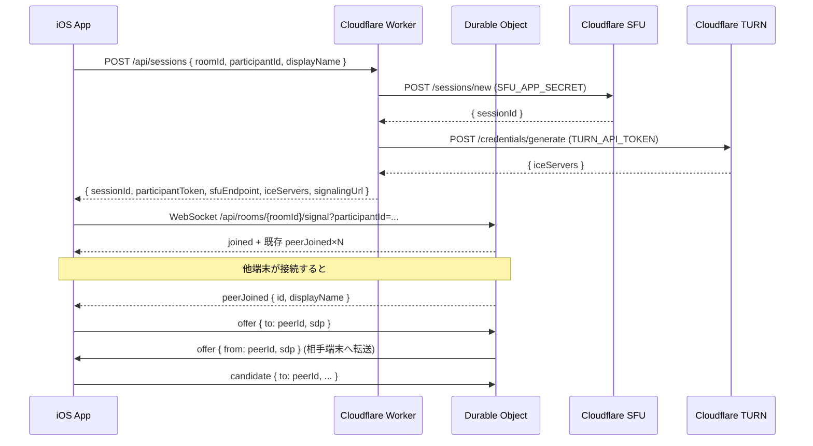

# Cloudflare Worker 仕様

## 背景と目的

Cloudflare SFU (Realtime) と Cloudflare TURN のクレデンシャル生成には APP_SECRET / TURN_API_TOKEN が必要で、これらはクライアントに置けない。Cloudflare Worker がシークレットを保持し、クライアントにトークンを発行する。WebRTC ピア間のシグナリング（offer/answer/ICE）は Durable Object が WebSocket ハブとして中継する。外部サービスを使わず Cloudflare のみで完結する構成。

## Cloudflare サービス構成

| サービス | 用途 | 必要なシークレット |
|---|---|---|
| Cloudflare SFU | SFU: セッション発行・メディアルーティング | `CLOUDFLARE_SFU_APP_ID`、`CLOUDFLARE_SFU_APP_SECRET` |
| Cloudflare TURN | ICE relay: NAT越え | `CLOUDFLARE_TURN_KEY_ID`、`CLOUDFLARE_TURN_API_TOKEN` |
| Cloudflare Workers | HTTP API: セッション発行・TURN クレデンシャル配布 | — (上記を環境変数で受け取る) |
| Cloudflare Durable Objects | WebSocket シグナリングハブ: ルーム単位で常駐 | — |

## ファイル構成

```
server/
├── wrangler.toml        # Worker 設定・Durable Object バインディング
├── package.json
├── tsconfig.json
└── src/
    ├── index.ts         # Worker エントリ: ルーティング・API ハンドラ
    ├── SignalingRoom.ts # Durable Object: WebSocket シグナリングハブ
    └── types.ts         # 共通型定義
```

## シークレット設定

Worker にシークレットを登録する（`wrangler.toml` に値を書かない）。

```sh
wrangler secret put CLOUDFLARE_SFU_APP_ID
wrangler secret put CLOUDFLARE_SFU_APP_SECRET
wrangler secret put CLOUDFLARE_TURN_KEY_ID
wrangler secret put CLOUDFLARE_TURN_API_TOKEN
```

各値は Cloudflare Dashboard の以下の場所から取得する。

| 変数 | 取得場所 |
|---|---|
| `CLOUDFLARE_SFU_APP_ID` | Cloudflare Dashboard → Realtime → App |
| `CLOUDFLARE_SFU_APP_SECRET` | 同上 |
| `CLOUDFLARE_TURN_KEY_ID` | Cloudflare Dashboard → Realtime → TURN |
| `CLOUDFLARE_TURN_API_TOKEN` | 同上 |

## HTTP API

### セッション作成

iOS アプリが通話開始前に呼び出す。Worker が Cloudflare SFU セッションと TURN クレデンシャルを生成して返す。

```
POST /api/sessions
Content-Type: application/json
```

**リクエスト**

| フィールド | 型 | 説明 |
|---|---|---|
| `roomId` | string | ルーム識別子（= groupHash） |
| `participantId` | string | 自端末の PeerID |
| `displayName` | string | 表示名 |

**レスポンス `200`**

| フィールド | 型 | 説明 |
|---|---|---|
| `sessionId` | string | Cloudflare Calls セッション ID |
| `participantToken` | string | `sessionId` と同値。`CloudflareRealtimeConfiguration.participantToken` に渡す |
| `sfuEndpoint` | string | `https://rtc.live.cloudflare.com/v1/apps/{APP_ID}` |
| `iceServers` | IceServer[] | TURN クレデンシャル。`CloudflareRealtimeConfiguration.iceServers` に渡す |
| `signalingUrl` | string | WebSocket URL。`wss://{worker-host}/api/rooms/{roomId}/signal` |

**`IceServer`**

| フィールド | 型 |
|---|---|
| `urls` | string[] |
| `username` | string? |
| `credential` | string? |

**エラー**

| ステータス | 原因 |
|---|---|
| `400` | `roomId` または `participantId` が欠落 |
| `502` | Cloudflare Calls API 呼び出し失敗 |

TURN クレデンシャル取得失敗は非致命的。`iceServers: []` で返し、STUN のみで接続を試みる。

---

### WebSocket シグナリング

```
GET /api/rooms/{roomId}/signal
Upgrade: websocket
?participantId={id}&displayName={name}
```

Durable Object `SignalingRoom` が WebSocket を受け付け、ルーム内の全参加者へシグナリングメッセージを中継する。

## WebSocket シグナリングプロトコル

### 接続直後に受け取るメッセージ（server → client）

```
{ type: "joined", peer: { id, displayName } }
```
自分自身の join 確認。ルーム内の既存参加者分の `peerJoined` がこの前に届く。

```
{ type: "peerJoined", peer: { id, displayName } }
```
他の参加者が入室した（または接続時点で既にいた）。

### クライアント → サーバー

| メッセージ | フィールド | 説明 |
|---|---|---|
| `offer` | `to: string`, `sdp: string` | WebRTC offer を特定ピアへ送る |
| `answer` | `to: string`, `sdp: string` | WebRTC answer を特定ピアへ送る |
| `candidate` | `to: string`, `sdp`, `sdpMid`, `sdpMLineIndex` | ICE candidate を特定ピアへ送る |
| `appData` | `to: string\|null`, `namespace: string`, `payload: string` | アプリデータ。`to: null` でブロードキャスト |

### サーバー → クライアント

| メッセージ | フィールド | 説明 |
|---|---|---|
| `peerJoined` | `peer: { id, displayName }` | 参加者入室通知 |
| `peerLeft` | `peerId: string` | 参加者退室通知 |
| `offer` | `from: string`, `sdp: string` | 他ピアからの offer |
| `answer` | `from: string`, `sdp: string` | 他ピアからの answer |
| `candidate` | `from: string`, `sdp`, `sdpMid`, `sdpMLineIndex` | 他ピアからの ICE candidate |
| `appData` | `from: string`, `namespace`, `payload` | 他ピアからのアプリデータ |
| `error` | `message: string` | プロトコルエラー通知 |

## iOS 側の利用フロー



## CloudflareRealtimeConfiguration へのマッピング

Worker レスポンスを iOS 側で `CloudflareRealtimeConfiguration` に組み立てる。

| `CloudflareRealtimeConfiguration` フィールド | Worker レスポンス |
|---|---|
| `sfuEndpoint` | `sfuEndpoint` |
| `roomID` | リクエストに使った `roomId` |
| `participantToken` | `participantToken` |
| `iceServers` | `iceServers` (`WebRTCIceServer` に変換) |

`signalingUrl` は `CloudflareRealtimeSignalingClient` の WebSocket 接続先として使う。

## デプロイ

```sh
cd server
npm install
wrangler secret put CLOUDFLARE_SFU_APP_ID
wrangler secret put CLOUDFLARE_SFU_APP_SECRET
wrangler secret put CLOUDFLARE_TURN_KEY_ID
wrangler secret put CLOUDFLARE_TURN_API_TOKEN
wrangler deploy
```

ローカル開発は `wrangler dev`。Durable Object は `--local` フラグで動作する。

## 制約・注意

| 項目 | 内容 |
|---|---|
| 認証 | 現在なし。Cloudflare WAF や Rate Limiting で保護することを推奨 |
| TURN TTL | 24時間固定。通話時間が長い場合は再取得が必要 |
| Durable Object 永続性 | ルームの WebSocket 状態はメモリのみ。Worker 再起動で参加者リストはリセットされる |
| Cloudflare Calls 無料枠 | 1000 participant-minutes/month。超過課金あり |
