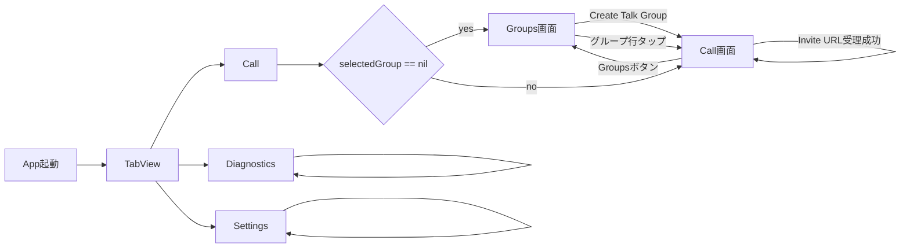
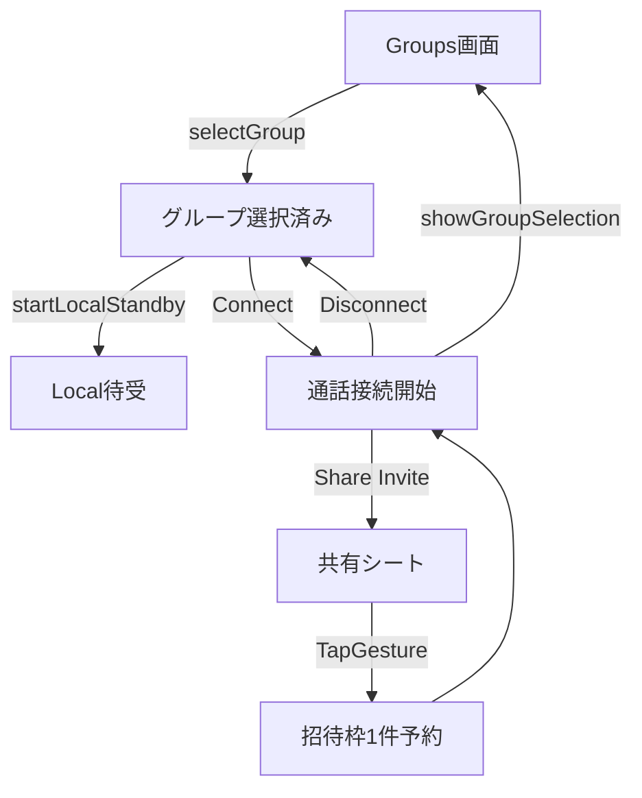
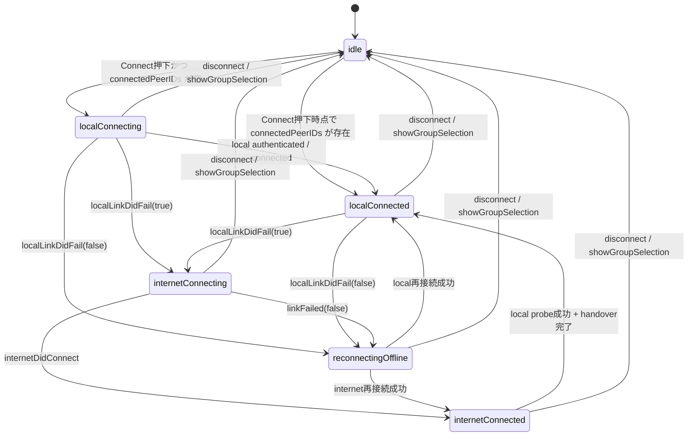
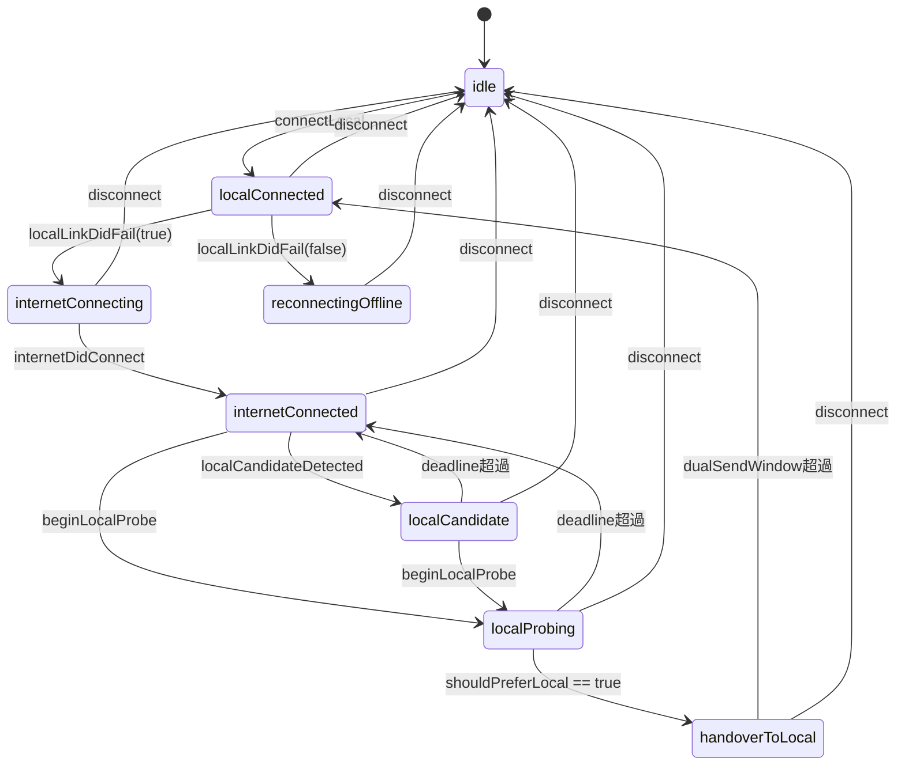
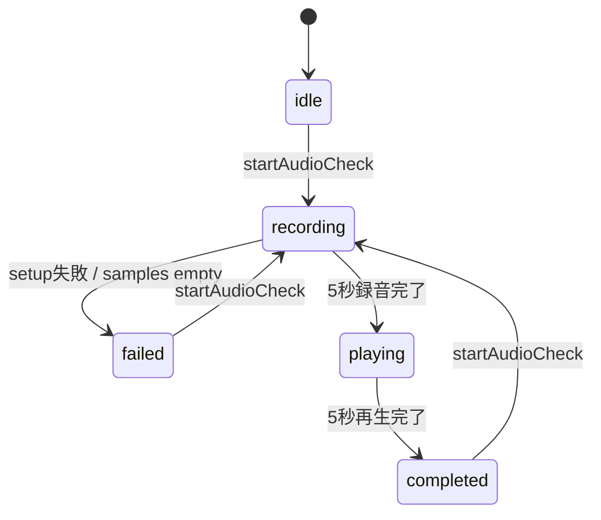
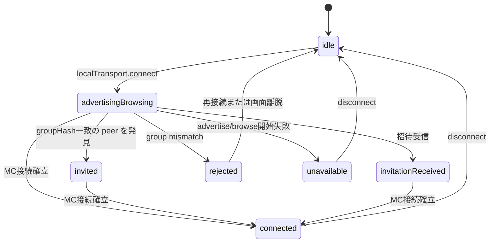
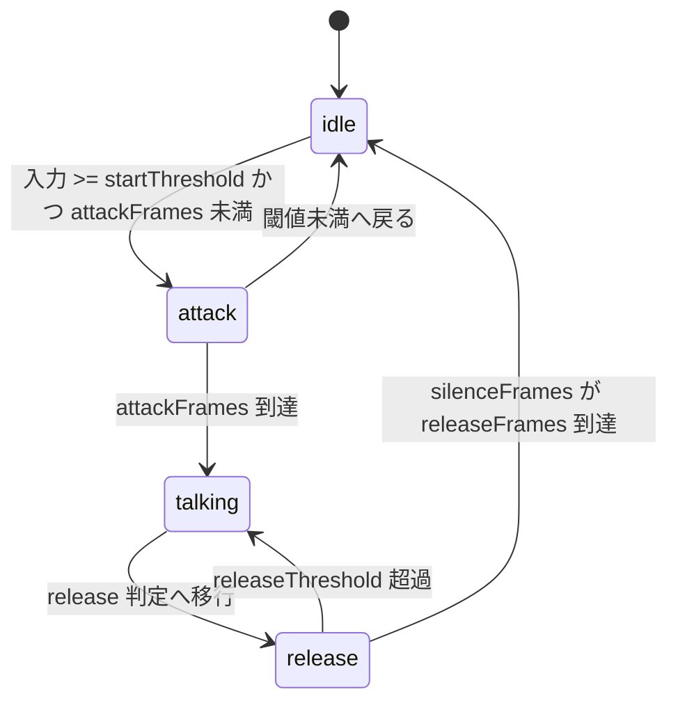

# RideIntercom 画面・状態遷移

## 目的

本書は現行実装の画面遷移と主要状態遷移を示す。  
対象は `ContentView.swift` と `IntercomCore.swift` に存在する遷移のみであり、未実装構想は含めない。

## 画面遷移

## Call 画面内の業務遷移

補足:

| 項目 | 現行仕様 |
|---|---|
| グループ選択直後 | 音声は開始せず、`startLocalStandby()` で Local 探索のみ開始 |
| Connect 押下 | 音声パイプライン開始後に接続状態をアクティブ化 |
| Invite | 共有シートを開くのみ。QR 画面や専用招待画面はない |

## CallConnectionState

対象: `CallConnectionState`

## RouteCoordinator.phase

対象: `RouteCoordinator.Phase`

## AudioCheckPhase

対象: `AudioCheckPhase`

## LocalNetworkStatus

対象: `LocalNetworkStatus`

## VoiceActivityState

対象: `VoiceActivityState`

## 補助状態

| 状態 | 遷移概要 |
|---|---|
| `selectedGroup` | `nil` なら Groups 画面、非 `nil` なら Call 画面 |
| `audioCheckOwnsAudioPipeline` | 通話未開始時に Audio Check がセッションを所有し、完了/失敗時に解放 |
| `isMicrophoneCaptureSuspendedByMute` | ミュート継続 2 秒後に `true` となり、解除時に再開を試行 |

## 実装トレーサビリティ

| 遷移対象 | 実装 |
|---|---|
| 画面遷移 | `RideIntercom/RideIntercom/ContentView.swift` |
| 通話状態 | `RideIntercom/RideIntercom/IntercomCore.swift` |
| Local Transport 状態 | `RideIntercom/RideIntercom/MultipeerLocalTransport.swift` |
