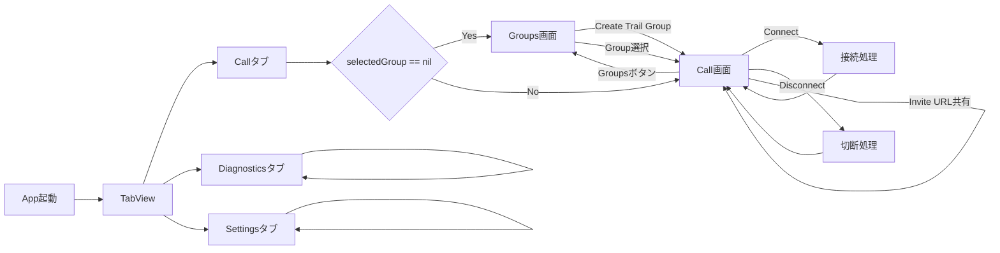
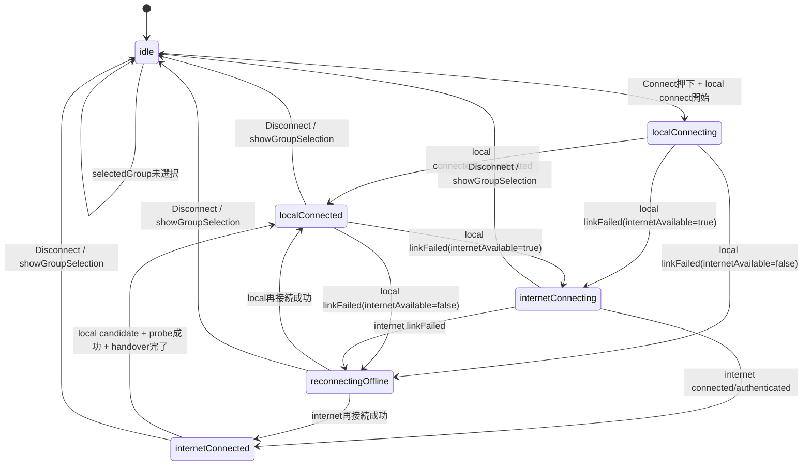
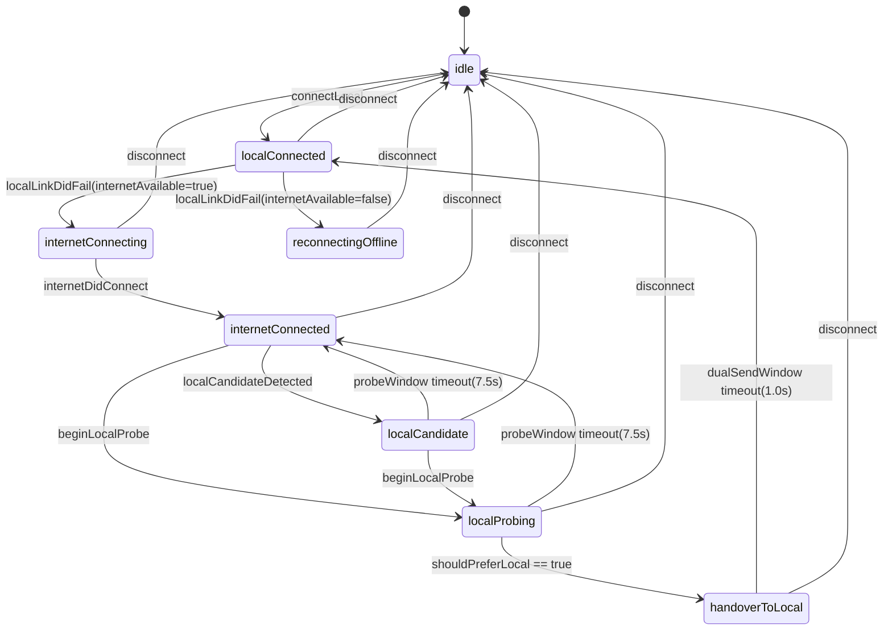
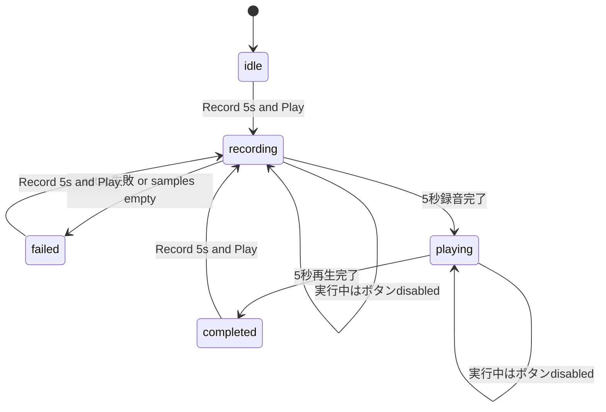
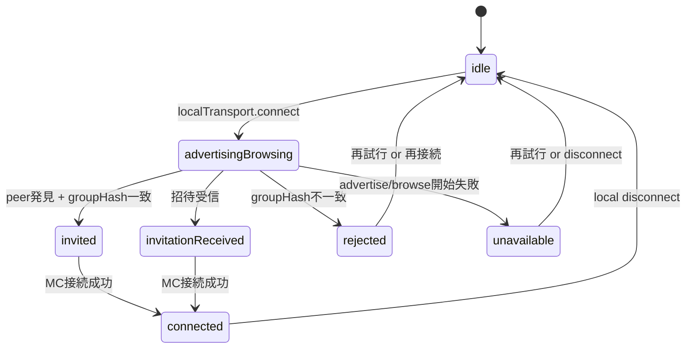
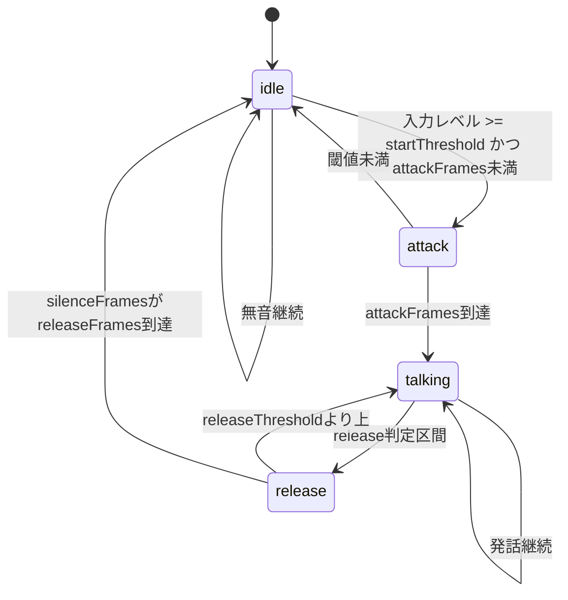

# RideIntercom 画面・状態遷移

## 目的

本ドキュメントは、現行実装における画面遷移と主要状態遷移を可視化する。  
実装者・テスターが同じ遷移モデルで確認できるよう、Mermaid図で定義する。

## 画面遷移（Tab + Call内部）

## Call 接続状態遷移

対象: CallConnectionState

## 経路制御状態遷移

対象: RouteCoordinator.phase

## Audio Check 状態遷移

対象: AudioCheckPhase

## Local Network 状態遷移

対象: LocalNetworkStatus

## VAD 状態遷移

対象: VoiceActivityState

## 実装トレーサビリティ

| 遷移対象 | 主実装 |
|---|---|
| 画面遷移（タブ/Call内部） | RideIntercom/ContentView.swift |
| CallConnectionState | RideIntercom/IntercomCore.swift |
| RouteCoordinator.phase | RideIntercom/IntercomCore.swift |
| AudioCheckPhase | RideIntercom/IntercomCore.swift |
| LocalNetworkStatus | RideIntercom/IntercomCore.swift, RideIntercom/PlatformLocalTransportSupport.swift |
| VoiceActivityState | RideIntercom/IntercomCore.swift |

