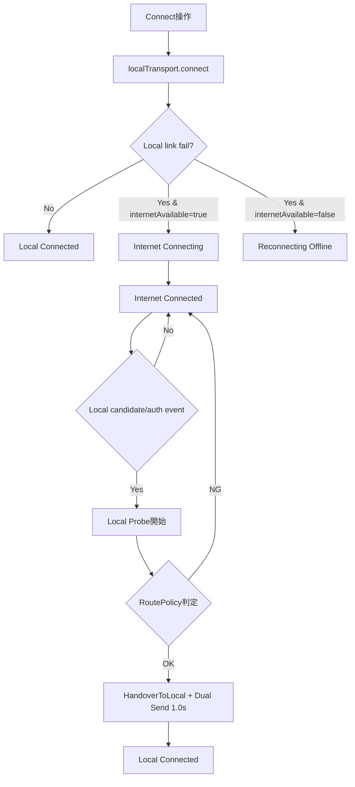
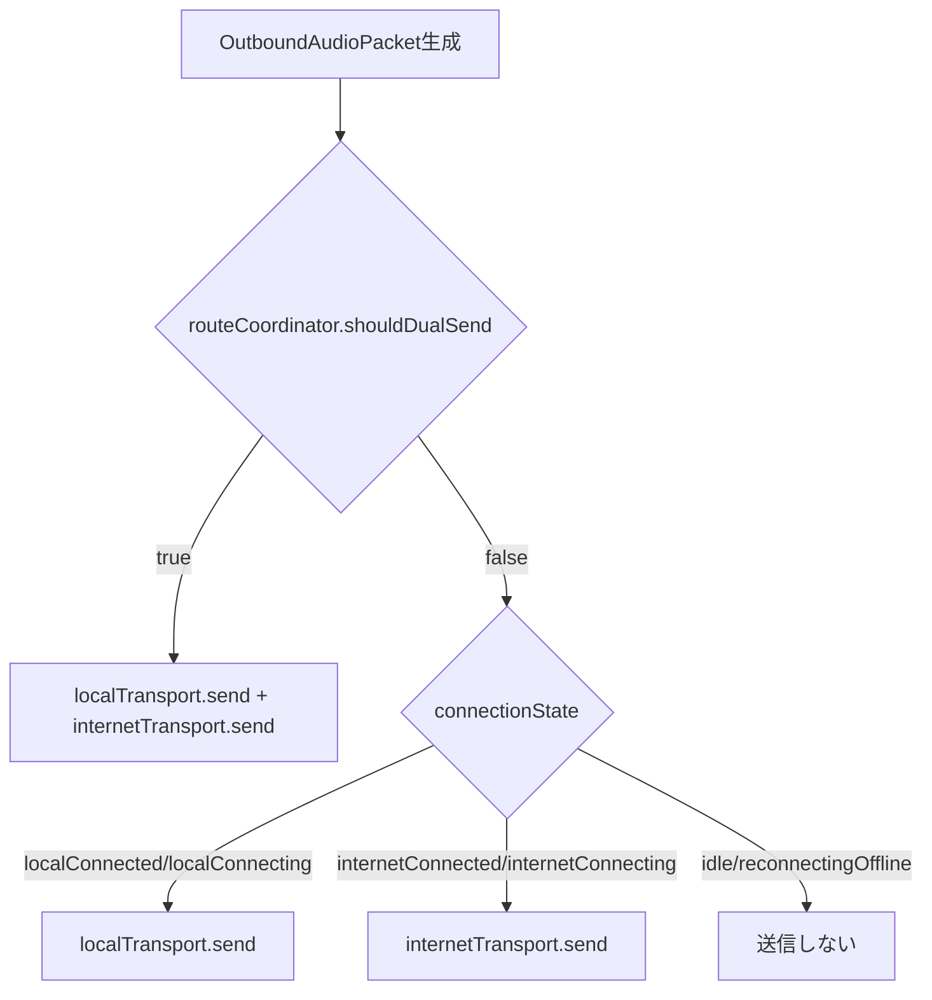

# RideIntercom 通信仕様

## 目的

本仕様は、現行実装における通信経路、経路選択判定、認証、暗号化、送受信データ形式を定義する。  
通信方式の切替条件は判定表とMermaid図で明示する。

## 適用範囲

| 区分 | 対象 |
|---|---|
| ローカル通信 | MultipeerConnectivity 経由の P2P 通信 |
| インターネット通信 | GameKit / WebSocket adapter 経由の通信 |
| 経路制御 | Local優先、障害時Internetフォールバック、再Local化判定 |
| 非対象 | サーバー実装仕様（本書ではクライアント側のみ定義） |

## 通信レイヤ構成

| 層 | 主実装 | 役割 |
|---|---|---|
| ViewModel統合層 | IntercomViewModel | Transportイベント集約、経路状態更新 |
| 経路制御層 | RouteCoordinator | Local/Internet/dual-send の状態遷移 |
| ローカルTransport層 | MultipeerLocalTransport | MC広告・探索・招待・暗号化音声転送 |
| Internet Transport層 | InternetTransport + InternetTransportAdapter | GameKit/WS送受信 |
| ペイロード層 | MultipeerPayloadBuilder / AudioPacketCodec | envelope化、control/audio符号化 |
| 認証・暗号層 | HandshakeService / PacketCryptoService | peer認証、AES-GCM暗号化 |

## 経路選択仕様

### 判定に使う状態

| 項目 | 値 |
|---|---|
| 接続状態 | idle / localConnecting / localConnected / internetConnecting / internetConnected / reconnectingOffline |
| RouteCoordinator phase | idle / localConnected / internetConnecting / internetConnected / localCandidate / localProbing / handoverToLocal / reconnectingOffline |
| 判定窓 | probeWindow = 7.5秒, dualSendWindow = 1.0秒 |

### Local優先・フォールバック・復帰判定

### RoutePolicy 判定条件

| 指標 | 条件 |
|---|---|
| peer数 | peerCount >= expectedPeerCount |
| RTT | rttMilliseconds <= 180 |
| Jitter | jitterMilliseconds <= 60 |
| Packet Loss | packetLossRate <= 0.10 |

### 送信先選択

## 接続シーケンス

### ローカル接続シーケンス

| 手順 | 動作 |
|---|---|
| 1 | groupHash を discoveryInfo に載せて advertise + browse 開始 |
| 2 | 発見peerの discoveryInfo と groupHash を比較 |
| 3 | 一致時 invite、不一致時 rejected(groupMismatch) |
| 4 | MC接続確立後、handshake(control reliable) を送信 |
| 5 | HandshakeRegistry で HMAC検証成功したpeerのみ authenticated |
| 6 | authenticated peer からの音声のみ受理 |

### インターネット接続シーケンス

| adapter | 接続方式 | 認証イベント |
|---|---|---|
| GameKitInternetTransportAdapter | GKMatch | player接続時 authenticated を発火 |
| URLSessionInternetTransportAdapter | WebSocket | control handshake受信時 authenticated を発火 |
| LoopbackInternetTransportAdapter | テスト/フォールバック | 接続時 authenticated を即時発火 |

## 認証・暗号化仕様

### 認証

| 項目 | 仕様 |
|---|---|
| 認証メッセージ | HandshakeMessage(groupHash, memberID, nonce, mac) |
| MAC | HMAC-SHA256(secret, "groupHash|memberID|nonce") |
| ローカル受理条件 | Handshake検証成功 + groupHash一致 |
| 未認証peer音声 | ローカルTransportでは破棄 |

### 暗号化

| 項目 | 仕様 |
|---|---|
| 音声ペイロード暗号 | AES.GCM（group credential由来 symmetric key） |
| 適用範囲 | Multipeer 音声payload encode/decode |
| 復号失敗時 | 受信破棄 |
| Internet payload | adapter層でJSON envelope化して転送（中身は AudioPacketCodec データ） |

## 送受信データ仕様

### AudioPacketEnvelope

| フィールド | 内容 |
|---|---|
| groupID | グループ識別 |
| streamID | ストリーム識別 |
| sequenceNumber | 連番 |
| sentAt | 送信時刻 |
| packet | voice(frameID,samples) または keepalive |
| encodedVoice | codec + payload（voice時、codecは pcm16/heAACv2/opus） |

### ControlMessage

| 種別 | 送信モード |
|---|---|
| keepalive | unreliable |
| handshake | reliable |
| peerMuteState | reliable |

### Keepalive

| 項目 | 仕様 |
|---|---|
| 送信条件 | 無音区間で keepaliveIntervalFrames 到達時 |
| 用途 | セッション維持、疎通維持 |

## 受信受理・再生前仕様

| 項目 | 仕様 |
|---|---|
| groupID検証 | ReceivedAudioPacketFilter で group一致のみ受理 |
| 認証検証 | authenticatedPeerIDs にないpeerは reject |
| 受信時刻補正 | packet.sentAt と now から accepted timestamp を算出 |
| ジッタバッファ | playoutDelay 0.015秒、packetLifetime 2.0秒 |

## エラー/障害時仕様

| 事象 | 動作 |
|---|---|
| Local browse/advertise開始失敗 | localNetworkStatus=unavailable + linkFailed(internetAvailable:false) |
| Local link fail & internetAvailable=true | connectionState を internetConnecting へ遷移し Internet connect 実施 |
| Local link fail & internetAvailable=false | reconnectingOffline へ遷移 |
| Internet receive失敗 | linkFailed(internetAvailable:false) |

## 設定値一覧との対応（通信で利用する項目）

参照元: [設定値一覧](設定値一覧.md)

| 設定値一覧の項目 | 通信での利用有無 | 利用内容 |
|---|---|---|
| 送信codec（preferredTransmitCodec） | 使用する | AudioPacketSequencer.codec に反映し送信payload codecを決定（Opus backend利用不可時は pcm16 へ解決） |
| HE-AAC品質（heAACv2Quality） | 使用する | HE-AACエンコード品質を決定し送信データ量/品質に影響 |
| VAD閾値（voiceActivityDetectionThreshold） | 使用する | voice/keepalive生成タイミングを変え、送信頻度に影響 |
| ローカルマイクミュート（isMuted） | 使用する | 音声packet送信停止、peerMuteState control送信 |
| 入力デバイス（selectedInputPort） | 間接的に使用する | 入力信号源変更により送信元音声に影響 |
| 出力デバイス（selectedOutputPort） | 使用しない | 再生先のみ変更、通信経路判定には不使用 |
| Sound Isolation（isSoundIsolationEnabled） | 間接的に使用する | 入力信号特性を変更しVAD/送信内容に影響 |
| Audio Check実行 | 使用しない | 診断経路であり通話通信判定には不使用 |
| マスター出力音量 | 使用しない | 受信後再生ゲインのみ |
| マスター出力ミュート | 使用しない | 受信後再生ゲインのみ |
| 参加者別出力音量 | 使用しない | 受信後再生ゲインのみ |

## 実装トレーサビリティ

| 仕様領域 | 主実装 |
|---|---|
| 経路選択 | RideIntercom/IntercomCore.swift（RouteCoordinator, handleTransportEvent） |
| ローカルTransport | RideIntercom/PlatformLocalTransportSupport.swift |
| Internet Transport | RideIntercom/PlatformInternetTransportSupport.swift |
| 認証・暗号・payload | RideIntercom/IntercomCore.swift（HandshakeService, PacketCryptoService, MultipeerPayloadBuilder） |

